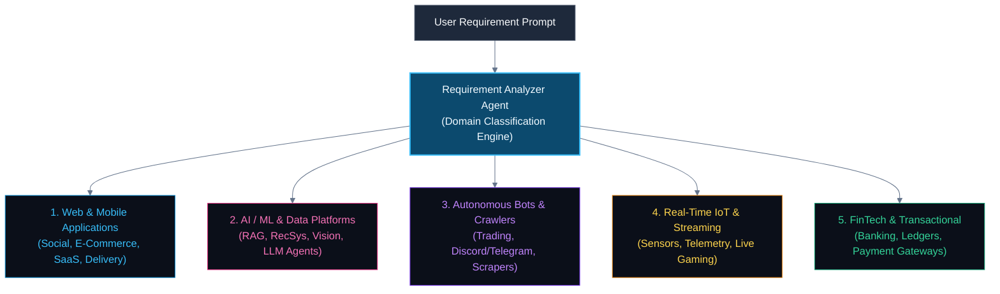
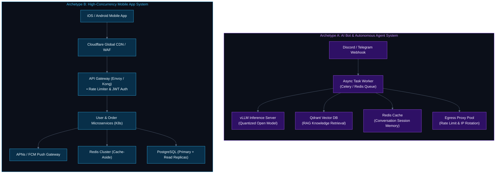
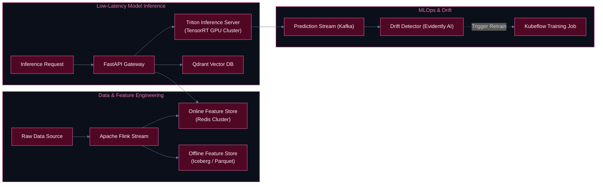

# NirmanAI — Universal Cross-Domain Architecture Guide

> **How NirmanAI Dynamically Synthesizes Architectures for AI/ML, Autonomous Bots, Web, Mobile, IoT, and FinTech Systems**

---

## 1. Executive Summary

A common limitation of architectural generators is being hardcoded to standard CRUD web applications. **NirmanAI** is built from the ground up as a **universal architecture synthesis engine**. 

Through its **Domain Classification Engine** inside the Requirement Analyzer Agent, NirmanAI detects the exact software archetype from a natural language requirement and dynamically injects domain-specific design patterns, protocols, datastores, and specialized subsystems.

---

## 2. Domain Archetype Breakdown

| Software Category | Typical Use Cases | Specialized Subsystems & Technologies Injected |
| :--- | :--- | :--- |
| **AI / ML & LLM Systems** | Multimodal RAG, Recommendation engines, Computer vision pipelines, LLM agent workflows | • **Vector Databases**: Qdrant, Milvus, Pinecone • **Feature Stores**: Feast (Online Redis + Offline S3/Iceberg) • **Inference Servers**: vLLM, Triton with GPU dynamic batching • **Drift & MLOps**: Evidently AI, MLflow, ground truth collection |
| **Bots & Autonomous Agents** | High-frequency trading bots, Telegram/Discord agents, Distributed web scrapers | • **Event / Webhook Listeners**: Asynchronous event loop workers • **Task Queues & Workers**: Celery / Redis BullMQ for concurrent tasks • **Session Memory**: Redis key-value & vector memory for chat state • **Proxy & Rate Limit Pools**: Egress IP rotation & backoff strategies |
| **Mobile & Web Apps** | Social media, Food delivery, E-Commerce, Collaborative document editing | • **Ingress**: Global CDN (Cloudflare), API Gateway with OAuth2/JWT • **Push Notifications**: APNs (Apple) & FCM (Firebase) • **Real-Time Layer**: WebSockets / SSE for bidirectional communication • **Data Tier**: Sharded PostgreSQL/MongoDB + Redis Cache-Aside |
| **Real-Time IoT & Telemetry** | Fleet vehicle GPS tracking, Smart factory sensors, Live multiplayer gaming | • **Ingestion Protocols**: MQTT (EMQX), gRPC bi-directional streaming • **Stream Processing**: Apache Kafka + Apache Flink windowing • **Time-Series Storage**: TimescaleDB, InfluxDB, ClickHouse |
| **FinTech & High-Integrity** | Core banking ledgers, Crypto settlement, P2P payment wallets | • **Distributed Transactions**: SAGA pattern with compensating transactions • **Data Integrity**: Strict ACID guarantees, Raft consensus, zero eventual consistency • **Security**: Hardware Security Modules (HSM), PCI-DSS tokenization |

---

## 3. Side-by-Side Visual Comparison: AI Bot vs. Mobile App

The following diagram illustrates how the generated architecture changes drastically between an **AI / Bot system** and a **High-Scale Mobile App**:

---

## 4. Deep Dive: The 5 Major Software Domains

### 4.1 AI / Machine Learning & Data Science Platforms

When an AI/ML prompt is provided (e.g., *"Build an AI-powered visual search engine for 50 million e-commerce images"*), NirmanAI automatically designs:
1. **Embedding Pipeline**: Offline image batch embedding ingestion into object storage (S3/MinIO) and index build in a Vector DB (**Qdrant / Milvus** with HNSW indexing).
2. **Feature Store**: Dual-tier storage using **Feast**:
   - *Online Store (Redis)*: Sub-5ms feature lookup for user embedding vectors.
   - *Offline Store (Apache Iceberg/S3)*: Parquet-formatted historical features for batch training.
3. **Inference Optimization**: **Triton Inference Server** with dynamic request batching, GPU memory paging, and TensorRT runtime.
4. **Continuous Feedback & Monitoring**: Ground truth capture into Kafka, evaluated by **Evidently AI** to trigger automated retraining upon feature/concept drift.

---

### 4.2 Autonomous Bots & Agentic Workflows

When the requirement specifies a bot or autonomous crawler (e.g., *"Build an automated arbitrage trading bot across decentralized exchanges"* or *"A multi-agent customer support bot"*):
1. **Event Ingestion**: Webhooks / long-polling listeners connected to message brokers with zero backpressure loss.
2. **Execution Workers**: Celery / Redis BullMQ workers executing asynchronous, non-blocking coroutines.
3. **Session State & Working Memory**: Redis key-value store maintaining short-term conversational context or active order book states.
4. **Anti-Blocking & Resilience**: Egress proxy pools with automatic circuit breakers and rotating user-agent headers.

---

### 4.3 High-Scale Mobile & Web Applications

For consumer-facing platforms (e.g., *"Ride-sharing app like Uber"* or *"Video sharing like TikTok"*):
1. **Client Edge**: Anycast DNS + CDN (Cloudflare/Fastly) caching static media and terminating TLS 1.3 near the user.
2. **Stateless Microservices**: Deployed on Kubernetes with Horizontal Pod Autoscaling (HPA) driven by CPU and custom request metrics.
3. **Push & Real-Time Sync**: WebSockets for live driver location and push gateways (APNs / FCM) for background notifications.
4. **Geo-Sharded Data Stores**: Relational databases partitioned by geographical region (e.g., `hash(city_id, user_id)`) to eliminate cross-region latency.

---

### 4.4 Real-Time IoT & Streaming Systems

For hardware, telemetry, and smart sensor fleets:
1. **Lightweight Protocols**: Ingestion via **MQTT** using high-throughput brokers like **EMQX** or **Mosquitto**.
2. **Stream Processing**: **Apache Kafka** partitioned by device UUID, consumed by **Apache Flink** for rolling-window anomaly detection.
3. **Time-Series Storage**: **TimescaleDB** or **ClickHouse** configured with data retention policies (e.g., 7 days raw data $\to$ 1 year rollups).

---

### 4.5 FinTech & High-Integrity Systems

For financial transactions, wallets, and double-entry ledgers:
1. **Strict ACID Guarantees**: Relational databases with serializable isolation levels and distributed consensus (**Raft**).
2. **Distributed SAGA Pattern**: Orchestration-based SAGA using Kafka topics with compensating transactions to avoid partial state failures.
3. **Idempotency & Deduplication**: Unique idempotency keys on every transaction request with Redis distributed locks.

---

## 5. Live Demonstration Scenarios (For PDS Presentations)

You can demonstrate NirmanAI's versatility live by executing these three vastly different prompts:

### Scenario 1: AI / Multimodal RAG System
> *"Design a medical AI diagnostic platform where doctors upload CT scans and patient histories to query diagnoses with sub-second vector search, HIPAA compliance, and model drift monitoring."*
* **Expected NirmanAI Output**: Qdrant Vector DB, Triton Inference Server, Feast Feature Store, S3 DICOM Object Store, and Evidently AI drift monitor.

### Scenario 2: Autonomous Trading Bot System
> *"Design a low-latency cryptocurrency arbitrage trading bot monitoring 10 exchanges with sub-millisecond price ingestion, automated order execution, risk circuit breakers, and crash recovery."*
* **Expected NirmanAI Output**: Asynchronous WebSocket worker pools, in-memory order books, Redis distributed locks, FIX protocol gateways, and dead-letter queues.

### Scenario 3: High-Scale Consumer Mobile App
> *"Design a food delivery mobile platform for 30 million users with live GPS courier tracking, restaurant menu search, order dispatching, and push notifications."*
* **Expected NirmanAI Output**: CDN + API Gateway, Kafka dispatch topic, Redis Geo-spatial index for driver matching, PostgreSQL sharded by city, and APNs/FCM push servers.

---

## 6. Summary

NirmanAI does **not** generate one-size-fits-all architectures. Its **Domain Classification Engine** ensures that every generated system design is purpose-built with the exact components, protocols, and data models required by that specific software domain.
