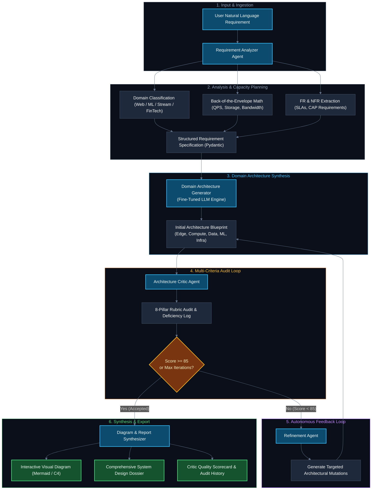
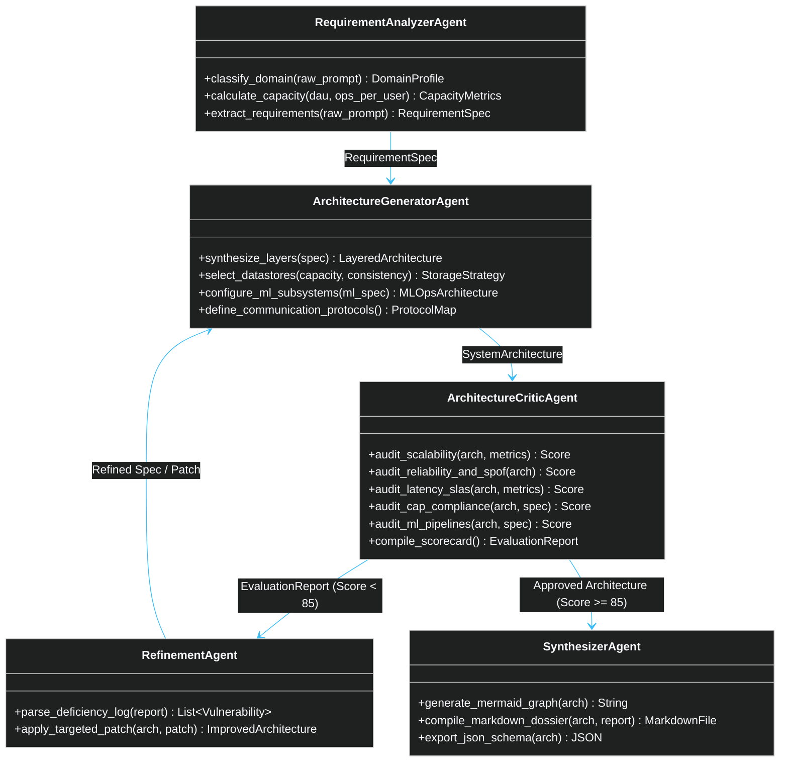
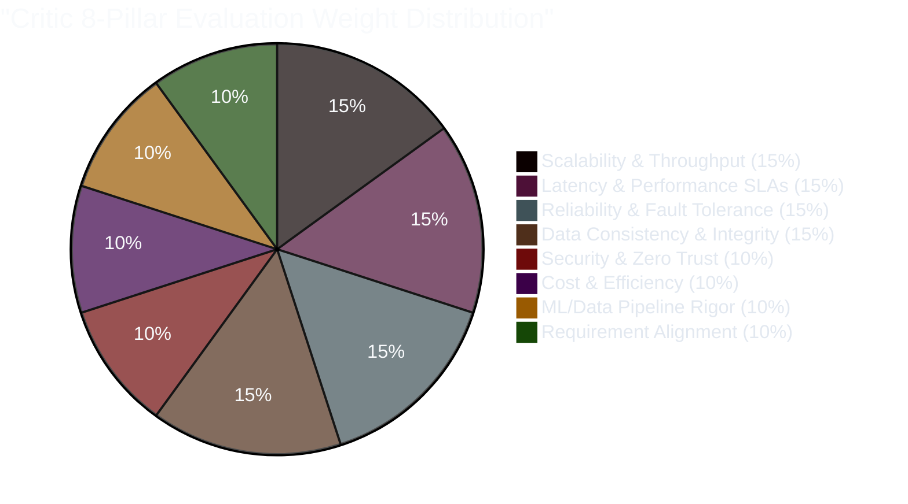
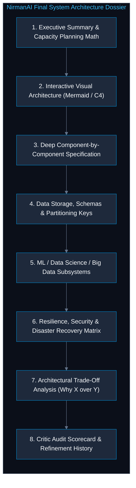
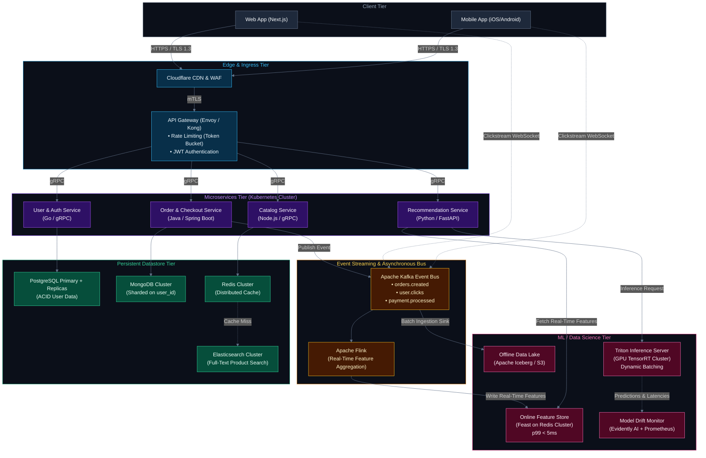

# NirmanAI (निर्माणAI)

> **Autonomous Multi-Agent System Architecture Synthesis & Self-Refining Evaluation Engine**

[](https://www.python.org/downloads/)
[](https://github.com/langchain-ai/langgraph)
[](https://docs.pydantic.dev/)
[](https://fastapi.tiangolo.com/)
[](https://opensource.org/licenses/MIT)

---

## 1. Executive Overview

Designing scalable, fault-tolerant, and cost-effective software architectures is one of the most intellectually demanding challenges in software engineering. When presented with complex, high-scale requirements, typical general-purpose Large Language Models (LLMs) fall into common traps:
* **Superficial Buzzword Generation**: Recommending popular tools (e.g., *"use Kafka and Redis"*) without justifying partition keys, caching topologies, or latency trade-offs.
* **Lack of Capacity Estimation**: Ignoring back-of-the-envelope calculations (e.g., QPS, ingress/egress bandwidth, storage growth, and memory footprints).
* **Single-Shot Hallucinations**: Producing single points of failure (SPOFs), missing asynchronous decoupling, or pairing incompatible consistency models.
* **No Validation or Self-Correction**: Providing no quantifiable metric to assess whether the design satisfies non-functional SLAs.

**NirmanAI** solves this problem by framing system architecture design not as a one-shot generation task, but as an **autonomous, iterative engineering feedback loop**. NirmanAI couples a **domain-fine-tuned architecture LLM** with a **multi-agent orchestration framework (Analyzer, Generator, Critic, and Refinement agents)**. It produces mathematically grounded, production-grade system designs across diverse domains—including **High-Concurrency Web Systems, Real-Time Distributed Streaming, and Large-Scale Machine Learning / Data Science (MLOps) Platforms**.

---

## 2. Core Innovations

1. **Domain-Specific Fine-Tuned Model**: Rather than relying purely on off-the-shelf prompt engineering, NirmanAI utilizes an open-weight LLM (e.g., Llama-3.1-8B, Qwen-2.5-7B) fine-tuned with QLoRA on a curated corpus of real-world system design RFCs, postmortems, and distributed systems trade-off matrices.
2. **Deterministic Back-of-the-Envelope Capacity Math**: The Requirement Analyzer derives concrete figures (Peak QPS, Read/Write ratios, daily network ingress/egress, 1-to-5-year storage projections) before any architectural component is selected.
3. **Multi-Dimensional Critic Audit**: An independent Critic Agent stress-tests the design against an 8-pillar rubric (Scalability, Latency, Reliability, Consistency, Security, Cost, ML Pipeline Rigor, Requirement Fit), scoring it from 0 to 100.
4. **Autonomous Refinement Feedback Loop**: If the architecture falls below the target threshold (e.g., 85/100), the Refinement Agent iteratively applies surgical architectural patches based on the Critic's deficiency log until the system converges.
5. **First-Class ML / Data Science / Big Data Subsystems**: Seamlessly generates end-to-end architectures for ML/DS systems, including feature stores, streaming aggregation, vector databases, GPU inference clusters, and drift-monitoring pipelines.

> 📖 **Full Cross-Domain Guide**: For deep-dive architectural blueprints covering **AI/ML systems, Autonomous Bots, Web/Mobile Apps, IoT, and FinTech**, see [DOMAIN_SUPPORT.md](DOMAIN_SUPPORT.md).

---

## 3. End-to-End System Workflow

The following flowchart illustrates the lifecycle of a requirement as it flows through the NirmanAI multi-agent loop:



---

## 4. Multi-Agent System Roles & Responsibilities



### Agent Breakdown

| Agent | Input | Core Operation | Output Deliverable |
| :--- | :--- | :--- | :--- |
| **1. Requirement Analyzer** | Raw User Prompt | Domain detection, capacity math, FR/NFR extraction, SLA definition | `RequirementSpec` (Pydantic model) |
| **2. Architecture Generator** | `RequirementSpec` | Fine-tuned LLM inference across Edge, Compute, Data, ML, and Network layers | `SystemArchitecture` (Component graph) |
| **3. Architecture Critic** | `SystemArchitecture` + `RequirementSpec` | Audits against 8 pillars, calculates weighted score (0–100), logs vulnerabilities | `CriticEvaluation` (Deficiency Log + Scorecard) |
| **4. Refinement Agent** | `SystemArchitecture` + Deficiency Log | Resolves SPOFs, decouples synchronous bottlenecks, enhances caching/replication | `SystemArchitecture` (Patched Version) |
| **5. Synthesizer & Exporter** | Approved `SystemArchitecture` | Renders visual diagrams, formats trade-off tables, outputs complete dossier | Mermaid Diagram + PDF/Markdown Dossier |

---

## 5. The Critic's 8-Pillar Evaluation Rubric

Every candidate architecture is scored quantitatively across eight foundational criteria:



| Evaluation Pillar | Weight | Target Metric | Sample Score | Audit Focus |
| :--- | :---: | :--- | :---: | :--- |
| **Scalability & Throughput** | 15% | 10x Peak Headroom | 92 / 100 | Database sharding, HPA, stateless compute, connection pooling |
| **Latency & Performance** | 15% | p99 < 50ms | 88 / 100 | Async decoupling, CDN caching, cache-aside Redis, zero blocking I/O |
| **Reliability & Fault Tolerance**| 15% | 99.99% Availability | 85 / 100 | No SPOFs, Multi-AZ failover, circuit breakers, dead-letter queues |
| **Data Consistency & Integrity** | 15% | Strict CAP Adherence | 90 / 100 | SAGA patterns for distributed transactions, Raft / 2PC guarantees |
| **Security & Compliance** | 10% | Zero Trust Architecture | 84 / 100 | mTLS service mesh, JWT/OIDC gateway, AES-256 at-rest, TLS 1.3 |
| **Cost & Resource Efficiency** | 10% | Optimal Tiering | 80 / 100 | Hot/Warm/Cold storage tiers, rightsized clusters, spot GPU usage |
| **ML & Data Pipeline Rigor** | 10% | No Data Leakage | 90 / 100 | Real-time feature consistency, dynamic batching, drift monitoring |
| **Requirement Alignment** | 10% | 100% FR/NFR Coverage | 95 / 100 | Verifies every explicit user feature and constraint is addressed |
| **Composite Final Score** | **100%** | **Threshold: >= 85** | **89.2 / 100** | **Status: ACCEPTED (Proceed to Final Synthesizer)** |

1. **Scalability & Throughput (Weight: 15%)**: Evaluates database sharding, connection pooling, horizontal pod autoscaling (HPA), and stateless service decoupling under 10x peak traffic.
2. **Latency & Performance SLAs (Weight: 15%)**: Assesses p95/p99 latency guarantees, synchronous vs. asynchronous RPC call chains, CDN edge caching, and cache-aside eviction policies.
3. **Reliability & Fault Tolerance (Weight: 15%)**: Detects Single Points of Failure (SPOFs), multi-Availability-Zone (Multi-AZ) failovers, circuit breaker patterns (e.g., Resilience4j/Envoy), and dead-letter queues.
4. **Data Consistency & Integrity (Weight: 15%)**: Verifies alignment with the CAP theorem. Guarantees strong consistency (2PC / SAGA / Raft consensus) for transactional data and eventual consistency for high-velocity feeds.
5. **Security, Compliance & Zero Trust (Weight: 10%)**: Checks for mTLS service-to-service communication, JWT/OIDC authentication at the API Gateway, data encryption at rest (AES-256) and in transit (TLS 1.3), and PII tokenization.
6. **Cost & Operational Overhead (Weight: 10%)**: Identifies over-engineering (e.g., deploying an unneeded 12-node Kafka cluster for a low-throughput system) and recommends tiered storage (Hot/Warm/Cold).
7. **ML & Data Pipeline Rigor (Weight: 10%)**: *(Active for ML/DS workloads)* Audits training-serving skew, offline/online feature store consistency, inference batching strategies, and model drift detection.
8. **Requirement Fit & Constraint Satisfaction (Weight: 10%)**: Ensures every explicit user feature and implicit boundary condition is fully satisfied.

---

## 6. Anatomy of the Generated Architecture Output

When NirmanAI accepts an architecture, it generates a comprehensive, production-grade **System Architecture Dossier** consisting of 8 distinct modules:



### Module Breakdown

#### 1. Capacity Planning & Estimation Table
* **Traffic Projections**: Daily Active Users (DAU), Peak Concurrency, Read/Write QPS.
* **Storage Calculations**: Ingress payload per write, storage per month, 1-year and 5-year storage estimates with replication factor.
* **Network & Memory**: Bandwidth in Gbps, Redis cache sizing (80/20 rule: 20% hot data in RAM).

#### 2. Visual Architecture Diagram
* End-to-end visual mapping using **Mermaid.js** or **C4 Container Model**.
* Clear network segmentation: Public Edge / Ingress, Private VPC Services, Event Bus, Datastores, and Isolated ML/Data Enclaves.

#### 3. Component-by-Component Technical Specification
For every gateway, microservice, queue, database, and cache:
* **Selected Technology** (e.g., Envoy, ClickHouse, Apache Flink, Redis Cluster).
* **Selection Justification**: Concrete technical rationale over alternatives.
* **Communication Protocols**: gRPC/Protobuf for internal east-west traffic, WebSockets for bi-directional streaming, REST/GraphQL for north-south client access.

#### 4. Data Storage & Partitioning Strategy
* **Relational vs. NoSQL vs. Time-Series**: Exact database choices by workload type.
* **Partition / Shard Key**: Sharding keys chosen to prevent hot spots (e.g., `hash(tenant_id, user_id)`).
* **Caching Strategy**: Cache-Aside, Write-Through, or Write-Behind policies with explicit TTLs and LRU eviction.

#### 5. ML, Data Science & Big Data Pipelines *(When Applicable)*
* **Streaming & Aggregation**: Apache Kafka $\to$ Apache Flink for real-time feature transformation.
* **Feature Store Integration**: Dual-storage feature store (Low-latency Feast Redis online store + Snowflake/BigQuery offline store).
* **Inference Engine**: Triton Inference Server or vLLM with dynamic request batching, GPU auto-scaling, and TensorRT acceleration.
* **MLOps & Monitoring**: Ground truth aggregation, automated retraining triggers, and Evidently AI drift detectors.

#### 6. Resilience, Security & Failover Strategy
* **High Availability**: Multi-AZ Active-Active configuration, automated DB failover, RPO $< 1 \text{ min}$, RTO $< 5 \text{ mins}$.
* **Fault Isolation**: Circuit breakers, bulkheads, rate-limiting (Token Bucket algorithm), and dead-letter queues.
* **Security & Privacy**: Zero Trust network architecture, Mutual TLS (mTLS) via Istio Service Mesh, AES-256 encryption.

#### 7. Architectural Trade-Off Matrix
Structured justification tables documenting critical engineering decisions:
* *Option Chosen vs. Option Discarded* (e.g., Cassandra vs. DynamoDB, gRPC vs. JSON-REST, Kafka vs. RabbitMQ).
* Explicit pros, cons, and contextual justifications.

#### 8. Critic Audit Scorecard & Iteration Changelog
* Granular rubric scores for each of the 8 pillars.
* Step-by-step history showing how initial deficiencies (e.g., Score: 68) were systematically addressed by the Refinement Agent to achieve the final accepted score (e.g., Score: 88).

---

## 7. Sample Visual Architecture (E-Commerce + Real-Time ML Recommendations)

The diagram below demonstrates the standard of architecture NirmanAI generates for a modern, high-scale system combining transactional workflows with real-time ML:



---

## 8. Fine-Tuning Pipeline & Dataset Strategy

NirmanAI achieves its architectural rigor through domain-specific fine-tuning.

```mermaid
%%{init: {'theme': 'dark', 'themeVariables': { 'darkMode': true, 'background': '#0b0f19', 'mainBkg': '#111827', 'lineColor': '#64748b' }}}%%
flowchart LR
    subgraph Data_Collection ["1. Dataset Construction"]
        D1["Engineering Blogs<br/>(Meta, Netflix, Uber, Stripe)"]
        D2["Distributed System RFCs<br/>& Academic Whitepapers"]
        D3["Postmortems & Failure Case Studies"]
        D1 & D2 & D3 --> S1["Data Synthesis & Formatting Engine"]
    end

    subgraph Formatted_Pairs ["2. Instruction Dataset"]
        S1 --> P1["Input: Problem Requirements + Constraints<br/>Output: FR/NFR + Capacity Math + Component Graph + Trade-offs"]
    end

    subgraph Training_Phase ["3. Efficient Fine-Tuning"]
        P1 --> T1["Base Model<br/>(Qwen-2.5-7B / Llama-3.1-8B)"]
        T1 --> T2["QLoRA 4-bit Quantization (Unsloth / PEFT)"]
        T2 --> T3["NirmanAI Architecture Model Adapter"]
    end

    subgraph Evaluation_Phase ["4. Comparative Benchmark"]
        T3 --> B1{"Evaluation Benchmark"}
        B1 -->|Baseline Zero-Shot LLM| R1["Avg Score: 62/100<br/>(Many SPOFs, Buzzwords)"]
        B1 -->|NirmanAI Fine-Tuned Model| R2["Avg Score: 78/100<br/>(Accurate Math, Real Trade-offs)"]
        B1 -->|NirmanAI + Multi-Agent Loop| R3["Avg Score: 91/100<br/>(Fully Audited, Production Grade)"]
    end

    classDef normal fill:#1e293b,stroke:#475569,color:#f8fafc,stroke-width:1px;
    classDef highlight fill:#0c4a6e,stroke:#38bdf8,color:#f0f9ff,stroke-width:2px;
    classDef win fill:#14532d,stroke:#4ade80,color:#f0fdf4,stroke-width:2px;

    class D1,D2,D3,P1,T1,T2 normal;
    class T3,B1 highlight;
    class R3 win;

    style Data_Collection fill:#0b0f19,stroke:#334155,stroke-width:1px,color:#94a3b8;
    style Formatted_Pairs fill:#0b0f19,stroke:#334155,stroke-width:1px,color:#94a3b8;
    style Training_Phase fill:#0b0f19,stroke:#0284c7,stroke-width:1px,color:#38bdf8;
    style Evaluation_Phase fill:#0b0f19,stroke:#15803d,stroke-width:1px,color:#4ade80;
```



---

## 9. Repository Structure

```
nirmanai/
├── README.md                           # Master Project Documentation & Architecture Blueprint
├── pyproject.toml                      # Poetry / Package Dependencies & Build Configuration
├── .env.example                        # Template for Environment Configuration
│
├── nirman/                             # Core Python Package
│   ├── __init__.py
│   │
│   ├── schemas/                        # Pydantic v2 Models (Strict Typing & Validation)
│   │   ├── __init__.py
│   │   ├── requirements.py             # User Requirements, FRs, NFRs & Capacity Specs
│   │   ├── architecture.py             # Nodes, Edges, Tech Stack, & Protocols
│   │   ├── ml_subsystems.py            # Feature Store, Inference, Training & Drift Specs
│   │   ├── critic.py                   # 8-Pillar Scoring Rubrics & Deficiency Log
│   │   └── dossier.py                  # Final Output Dossier Schema
│   │
│   ├── agents/                         # Autonomous Agent Implementations
│   │   ├── __init__.py
│   │   ├── analyzer.py                 # Requirement Analyzer & Capacity Math Engine
│   │   ├── generator.py                # Domain Architecture Generator (Fine-Tuned LLM)
│   │   ├── critic.py                   # Multi-Dimensional Rubric Evaluator
│   │   ├── refiner.py                  # Surgical Architectural Mutation Engine
│   │   └── synthesizer.py              # Mermaid Diagram & Markdown Dossier Compiler
│   │
│   ├── workflow/                       # Multi-Agent State Machine & Graph Loop
│   │   ├── __init__.py
│   │   ├── state.py                    # Shared State Definitions for LangGraph
│   │   └── graph.py                    # Cyclic State Machine (Analyzer -> Gen -> Critic -> Loop)
│   │
│   ├── finetuning/                     # LLM Dataset Preparation & Training Pipelines
│   │   ├── __init__.py
│   │   ├── dataset_generator.py        # Synthetic & Curated Architecture Dataset Builder
│   │   ├── train_qlora.py              # Unsloth / PEFT Fine-Tuning Script
│   │   └── evaluate_model.py           # Benchmark Evaluator (Base vs Fine-Tuned vs Loop)
│   │
│   └── api/                            # Production API Service
│       ├── __init__.py
│       ├── main.py                     # FastAPI Application Entrypoint
│       ├── routes.py                   # REST & SSE Streaming Endpoints
│       └── websockets.py               # Real-Time Agent Execution Streaming
│
├── evaluation/                         # Benchmarking & Validation Datasets
│   ├── benchmark_cases.json            # Standard System Design Problem Sets
│   └── run_benchmark.py                # Automated Evaluation Script
│
└── tests/                              # Comprehensive Test Suite
    ├── test_analyzer.py                # Capacity Math & Requirement Extraction Tests
    ├── test_critic.py                  # Rubric Scoring & SPOF Detection Tests
    ├── test_refinement_loop.py         # Convergence & Loop Termination Tests
    └── test_workflow.py                # End-to-End Orchestration Integration Tests
```

---

## 10. Technology Stack

| Category | Technology | Rationale & Selection Criteria |
| :--- | :--- | :--- |
| **Agent Orchestration** | **LangGraph** / Async State Machine | Cyclic state graph with typed transitions, conditional refinement loops, and step streaming. |
| **Data Validation** | **Pydantic v2** | Enforces strict JSON schemas for components, protocols, capacity estimates, and critic scores. |
| **Fine-Tuning Stack** | **Unsloth** + **Hugging Face PEFT** | 4-bit QLoRA fine-tuning on open models with low memory footprints and fast training convergence. |
| **Base Models** | **Qwen 2.5 (7B/14B)** or **Llama 3.1 (8B)** | High reasoning capacity, strong code/structured output generation, and easily deployable via Ollama/vLLM. |
| **Backend API** | **FastAPI** + **Uvicorn** | High-performance asynchronous REST and Server-Sent Events (SSE) for live streaming of agent thinking. |
| **Diagram Engine** | **Mermaid.js** & **C4 Model** | Declarative diagram generation embedded directly in Markdown and rendered dynamically on the web. |
| **Testing & Quality** | **Pytest** + **Pytest-Asyncio** | Complete unit and integration testing of agent loops, state transitions, and math formulas. |

---

## 11. Getting Started

### Prerequisites
* Python 3.11 or higher
* Node.js 18+ (for frontend dashboard, if applicable)
* Access to a GPU with 16GB+ VRAM (for local fine-tuning/inference) OR an API key (Ollama, vLLM, or OpenRouter/OpenAI/Gemini for testing)

### Installation

1. **Clone the repository**:
   ```bash
   git clone https://github.com/raj-ribadiya/nirmanai.git
   cd nirmanai
   ```

2. **Create and activate a virtual environment**:
   ```bash
   python3 -m venv .venv
   source .venv/bin/activate
   ```

3. **Install dependencies**:
   ```bash
   pip install --upgrade pip
   pip install -e .
   ```

4. **Configure environment variables**:
   ```bash
   cp .env.example .env
   # Edit .env with your LLM endpoint (Ollama / vLLM / OpenAI / Gemini)
   ```

5. **Run the CLI Generation Pipeline**:
   ```bash
   python -m nirman.cli --prompt "Design a real-time ride sharing platform like Uber for 50 million active users with low latency driver matching, dynamic pricing, and trip tracking."
   ```

6. **Start the FastAPI Backend Service**:
   ```bash
   uvicorn nirman.api.main:app --reload --port 8000
   ```

---

## 12. Project Development Seminar (PDS) Roadmap

- [x] **Phase 1: Project Architecture & Formal Specification**
  - [x] Complete system workflow and multi-agent cyclic diagram design.
  - [x] 8-Pillar Critic rubric formulation and deficiency detection criteria.
  - [x] Comprehensive Markdown/Mermaid specification.
- [ ] **Phase 2: Core Engine & Data Schemas**
  - [ ] Implement `nirman/schemas/` with strict Pydantic v2 data models.
  - [ ] Implement Requirement Analyzer with back-of-the-envelope capacity calculator.
  - [ ] Build the Critic Agent with automated rubric scoring algorithms.
- [ ] **Phase 3: Agent Orchestration & Self-Correction Loop**
  - [ ] Wire LangGraph cyclic state machine: `Analyzer -> Generator -> Critic -> Refiner`.
  - [ ] Implement convergence limits and dynamic patch application.
  - [ ] Add Mermaid diagram compiler for automatic visual export.
- [ ] **Phase 4: Domain Fine-Tuning & Benchmark Evaluation**
  - [ ] Curate 2,000+ architecture design question-answer pairs with detailed trade-offs.
  - [ ] Execute QLoRA fine-tuning using Unsloth.
  - [ ] Run comparative ablation studies (Base LLM vs Fine-Tuned vs Fine-Tuned + Agent Loop).
- [ ] **Phase 5: Interactive Web UI & Final Project Presentation**
  - [ ] Build FastAPI streaming endpoints (SSE) for live agent execution tracking.
  - [ ] Interactive React Flow / Mermaid diagram viewer with clickable component inspect drawers.
  - [ ] Exportable PDF/Markdown System Design Dossier.

---

## 13. License

Distributed under the MIT License. See `LICENSE` for more details.
