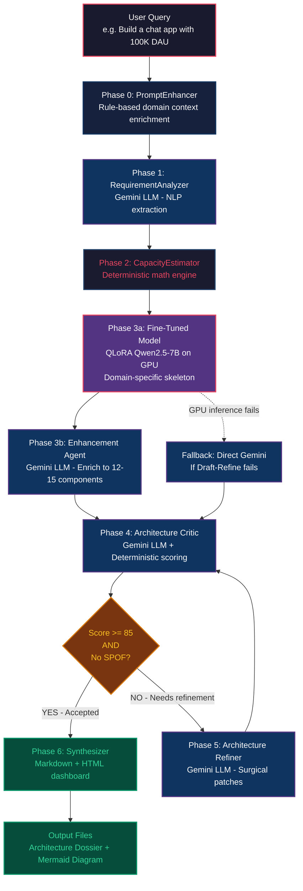

# NirmanAI — Pipeline Workflow

> **From a one-line user prompt to a production-grade system architecture dossier in 7 phases.**

---

## High-Level Pipeline Flow



---

## Phase-by-Phase Explanation

### Phase 0: PromptEnhancer (Rule-Based)

**Input:** Raw user prompt (e.g., `"Build a chat app with 100K DAU"`)

**What it does:**
- Detects the domain from keywords (FinTech, E-Commerce, Social, Gaming, IoT, etc.)
- Injects domain-specific SLAs and feature requirements automatically
- Example: Detects "chat" → Social domain → Adds `"P99 < 30ms feed retrieval, sub-100ms message delivery, 99.99% availability, WebSocket connection pooling"`

**Output:** Enriched prompt with domain context, SLAs, and feature requirements

**Engine:** Pure rule-based (no LLM call, instant)

---

### Phase 1: RequirementAnalyzer (Gemini LLM)

**Input:** Enhanced prompt from Phase 0

**What it does:**
- Extracts structured requirements from natural language via Gemini
- Outputs a `RequirementSpec` with:
  - **Functional Requirements** (e.g., "Real-time messaging", "User authentication")
  - **Non-Functional Requirements** (e.g., "P99 < 30ms", "99.99% uptime")
  - Domain classification, cloud provider, architectural style
  - Operational constraints

**Agent capabilities:**
- Self-validation: checks minimum 3 FRs, 2 NFRs
- Self-correction: feeds validation errors back to Gemini for re-generation
- Retry: up to 3 attempts

**Output:** `RequirementSpec` Pydantic object

**Engine:** Gemini 3.5-flash API

---

### Phase 2: CapacityEstimator (Deterministic Math)

**Input:** `RequirementSpec` from Phase 1

**What it does:**
- Calculates ALL capacity numbers deterministically (NO LLM math — LLMs can't do arithmetic reliably)
- Computes:
  - **Traffic:** Peak QPS = DAU × 7 requests/user ÷ 40,000 active seconds × 5x peak multiplier
  - **Storage:** Daily growth = DAU × 15KB/user/day → 5-year projection × 3x replication
  - **Cache:** Redis RAM = Hot set (20% of daily data) with recommended node count
  - **Network:** Ingress/Egress bandwidth from traffic × payload size
  - **Compute:** Kubernetes pod count from QPS ÷ 500 QPS/pod

**Output:** `CapacityMetrics` with exact numbers (e.g., DAU=100,000, Peak QPS=175, 5yr Storage=7.65 TB)

**Engine:** Pure Python math (no LLM, instant, deterministic)

---

### Phase 3: Architecture Generator (Draft → Refine)

This is the core innovation — a two-step generation using both models:

#### Phase 3a: Fine-Tuned Model (Local GPU)

**Input:** User prompt + `RequirementSpec` + `CapacityMetrics`

**What it does:**
- Runs the QLoRA fine-tuned Qwen2.5-7B-Instruct model on the local RTX A2000 GPU
- The model was trained on 20,000 system architecture examples
- It generates a **domain-specific skeleton** in its native format:
  - `system_overview`: Architecture narrative
  - `component_breakdown`: 6 domain-specific components with technology choices
  - `mermaid_diagram`: Base flowchart diagram
  - `trade_offs`: Architecture trade-off decisions
  - `bottlenecks_and_mitigation`: Identified bottlenecks

**Why the fine-tuned model matters:**
- For a vague prompt like "Build a chat app", this model KNOWS from 20K training examples that a chat system needs: WebSocket Gateway, Event Streaming (Kafka), Graph Store (Neptune), Timeline Fanout Workers, etc.
- Gemini alone with a vague prompt would produce generic components (API Gateway, Database, Cache)
- The fine-tuned model provides **domain-specific foundation** that Gemini enhances

**Output:** Raw dict with 6 domain-specific components

**Engine:** Local GPU (RTX A2000, 5.3 GB VRAM, ~3 min inference)

#### Phase 3b: Architecture Enhancement Agent (Gemini)

**Input:** Fine-tuned model's raw output + original prompt + spec + capacity

**What it does:**
- Takes the 6-component skeleton and **enhances** it (not replaces):
  - Keeps ALL domain-specific components from the fine-tuned model
  - Adds missing architectural layers (Auth, CDN, Observability, DR, Analytics, Service Mesh)
  - Expands to 12-15 total components with full schema compliance
  - Generates rich Mermaid diagram with:
    - Dark color theme (8 layer-based colors)
    - One-liner descriptions in each node
    - Labeled edges with protocols and data types
    - Dotted arrows for async/event flows, solid for sync
  - Adds 8-12 inter-service connections with specific protocols
  - Deepens trade-offs with quantitative impact
  - Adds bottleneck mitigations with numbers

**Agent capabilities:**
- Validates that enhancement actually ADDED components (not just replaced)
- Mermaid sanitization (Unicode fixes, special char quoting)
- Retry with self-correction on failure

**Output:** Full `SystemArchitecture` Pydantic object (14 components, 15 connections)

**Engine:** Gemini 3.5-flash API

#### Fallback Path

If the Draft→Refine process fails (GPU error, model issue, enhancement failure):
- Automatically falls back to **direct Gemini generation** (Phase 3 generates the full architecture via Gemini alone)
- This ensures the pipeline NEVER crashes — it always produces output

---

### Phase 4: Architecture Critic (Hybrid: Gemini + Algorithm)

**Input:** `SystemArchitecture` + `RequirementSpec` + `CapacityMetrics`

**What it does — Two-part evaluation:**

**Part 1 — Gemini LLM (Qualitative Analysis):**
- Acts as "Senior Principal Staff Architecture Auditor & Chaos Engineer"
- Evaluates the architecture against the **8-Pillar Rubric**:

| Pillar | Weight | What It Checks |
|:---|:---:|:---|
| Scalability & Throughput | 15% | DB sharding, HPA, stateless compute under peak traffic |
| Latency & Performance SLAs | 15% | CDN caching, Redis cache-aside, async decoupling |
| Reliability & Fault Tolerance | 15% | SPOFs, Multi-AZ failovers, circuit breakers, DLQs |
| Data Consistency & CAP | 15% | SAGA patterns, ACID boundaries, replication lag |
| Security & Zero Trust | 10% | mTLS service mesh, JWT/OIDC, AES-256, TLS 1.3 |
| Cost & Resource Efficiency | 10% | Right-sized clusters, storage tiering |
| ML/Data Pipeline Rigor | 10% | Feature consistency, model drift monitoring |
| Requirement Alignment | 10% | Does it satisfy ALL user requirements? |

- Detects **Single Points of Failure (SPOFs)**
- Logs **DeficiencyFinding** objects with severity, target component, flaw description, failure scenario, and prescribed patch

**Part 2 — Deterministic Algorithm (Math Override):**
- **NEVER trusts LLM arithmetic** — recalculates ALL weighted scores deterministically
- `weighted_score = raw_score × weight` (enforced per pillar)
- `overall_score = sum(weighted_scores)` (enforced globally)
- `is_accepted = (score >= 85) AND (no SPOF)` (enforced as boolean rule)
- Overrides LLM's arithmetic if it disagrees

**Output:** `CriticScorecard` with overall score, pillar breakdown, SPOF detection, deficiency log

---

### Quality Gate Decision

```
IF overall_score >= 85 AND spof_detected == False:
    → ACCEPTED → Route to Phase 6 (Synthesizer)
    
ELSE IF iterations < max_iterations:
    → REJECTED → Route to Phase 5 (Refiner) for improvements
    
ELSE:
    → Max iterations reached → Route to Phase 6 with best architecture
```

---

### Phase 5: Architecture Refiner (Gemini LLM — Conditional)

**Input:** `SystemArchitecture` + `CriticScorecard` (with deficiency log)

**What it does:**
- Reads the Critic's `deficiency_log` — specific patches like:
  - `"DEF-01: DB_PRIMARY has no Multi-AZ replica → Add Aurora Multi-AZ failover"`
  - `"DEF-02: No circuit breaker on PAYMENT_SVC → Add Resilience4j circuit breaker"`
- Applies **surgical patches** to the architecture (doesn't regenerate from scratch)
- Has **rollback safety**: if the refinement makes the score WORSE, reverts to the best previous architecture

**Agent capabilities:**
- Reads specific deficiency findings and applies targeted fixes
- State rollback: tracks `best_architecture` and `best_score`, reverts on regression
- Up to `max_iterations` refinement cycles (default: 2)

**Output:** Refined `SystemArchitecture` → feeds back to Phase 4 (Critic) for re-evaluation

**Engine:** Gemini 3.5-flash API

---

### Phase 6: Synthesizer (Output Generation)

**Input:** Best `SystemArchitecture` + `RequirementSpec` + `CapacityMetrics` + `CriticScorecard` + refinement history

**What it does:**
- Compiles everything into two deliverables:

**1. Markdown Dossier (`.md`):**
- Executive Summary & System Overview
- Capacity Planning table (DAU, QPS, storage, cache, pods)
- Visual Architecture Diagram (Mermaid with colors)
- Component Topology Breakdown table
- Trade-Off Analysis (3-5 decisions)
- Bottleneck Identification & Mitigation Strategies
- Critic Scorecard Audit (8-pillar table)

**2. Interactive HTML Dashboard (`.html`):**
- Dark-themed responsive UI
- Live Mermaid.js rendering (diagrams render in-browser)
- KPI cards for DAU, QPS, Storage, Cache
- Color-coded score badge (green/yellow/red)
- Component and connection tables
- Pillar score breakdown with progress bars

**Output:** Saved files at `output/{run_name}/architecture.md` and `architecture.html`

**Engine:** Pure Python template rendering (no LLM, instant)

---

## Complete Data Flow


---

## Engine Summary

| Phase | Agent | Engine | LLM? | Time |
|:---|:---|:---|:---:|:---:|
| 0 | PromptEnhancer | Rule-based keyword matching | No | < 1s |
| 1 | RequirementAnalyzer | Gemini 3.5-flash API | Yes | ~30s |
| 2 | CapacityEstimator | Deterministic Python math | No | < 1s |
| 3a | ArchitectureGenerator | Fine-tuned Qwen2.5-7B on GPU | Yes (local) | ~3 min |
| 3b | ArchitectureEnhancer | Gemini 3.5-flash API | Yes | ~30s |
| 4 | ArchitectureCritic | Gemini + Deterministic math | Hybrid | ~30s |
| 5 | ArchitectureRefiner | Gemini 3.5-flash API | Yes | ~30s |
| 6 | Synthesizer | Python template rendering | No | < 1s |
| | **Total** | | | **~5-8 min** |

---

## Key Design Decisions

### Why Draft → Refine instead of Gemini-only?

Users typically give **simple one-liner prompts** like "Build me an Amazon clone" or "Chat app with 100K DAU." These vague prompts give Gemini no domain context, resulting in generic architectures.

The fine-tuned model, trained on 20,000 architecture examples, **knows** what specific components each domain needs. It provides the domain-specific foundation that Gemini then enriches with structural depth, proper schema compliance, and quantitative analysis.

**Result:** 6 base components → 14 enhanced components. Score improved from 79.5 (fine-tuned alone) to 86.8-91.3 (Draft→Refine).

### Why deterministic scoring instead of trusting LLM?

LLMs make arithmetic errors. In testing, Gemini reported `weighted_score = 15.3` for a raw score of 82 at weight 0.15 — the correct answer is `12.3`. The deterministic algorithm catches and corrects these errors, ensuring scores are mathematically consistent and acceptance decisions are reliable.

### Why state rollback in the Refiner?

Refinement can sometimes make architectures worse (e.g., removing a component to fix one issue creates another). The pipeline tracks the best architecture and score across iterations. If a refinement regresses the score, it rolls back to the previous best.

---

## Example E2E Run

**Input:** `"Build a real-time chat application with 100K DAU and 100K throughput"`

**Output (8.7 minutes):**
- 14 components (API Gateway, CDN, Auth, WebSocket Gateway, Kafka, Neptune Graph DB, DynamoDB, S3, Redis, Istio, K8s, Data Lake, Observability, DR)
- 15 inter-service connections with protocols
- 63-line Mermaid diagram with dark color theme
- 86.8/100 critic score (all 8 pillars PASS)
- Full MD dossier + interactive HTML dashboard
