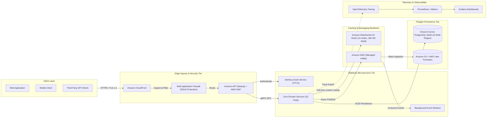

# 🏛️ FinTech & Payment Settlement System Architecture (50M DAU)
**Domain:** FinTech & Payment Settlement | **Style:** Microservices | **Cloud Platform:** AWS

## 1. System Overview
A production-grade, highly scalable Microservices architecture engineered for the FinTech & Payment Settlement domain deployed natively on AWS. The architecture is organized into segregated tiers including global edge ingress with automated DDoS mitigation, stateless containerized microservices running on Amazon EKS (Kubernetes) autoscaling to handle a peak load of 78,124 QPS, an asynchronous event streaming backbone powered by Amazon MSK (Managed Kafka), and an 80/20 in-memory Redis cluster allocating 186 GB RAM for sub-5ms p99 read latencies. Data persistence is backed by Amazon Aurora PostgreSQL (Multi-AZ Multi-Region) with multi-AZ active replication supporting 3824.2 TB across a 5-year operational lifecycle.

## 2. Deterministic Capacity Planning Calculations
| Metric Category | Parameter | Calculated Value |
| :--- | :--- | :--- |
| **Traffic** | Daily Active Users (DAU) | **50,000,000** |
| **Traffic** | Read / Write Ratio | **80:20** |
| **Traffic** | Average Throughput | **17,361 QPS** |
| **Traffic** | Peak Throughput | **78,124 QPS** |
| **Network** | Peak Ingress Bandwidth | **0.298 Gbps** |
| **Network** | Peak Egress Bandwidth | **2.384 Gbps** |
| **Storage** | Daily Raw Data Growth | **715.26 GB/day** |
| **Storage** | 5-Year Net Data Footprint | **1274.75 TB** |
| **Storage** | 5-Year Physical Footprint (3x Multi-AZ) | **3824.25 TB** |
| **Memory** | Redis 80/20 Hot Working Set RAM | **186.0 GB** (13 nodes) |
| **Compute** | Recommended Kubernetes Pod Count | **~33 Pods** |

## 3. Visual System Architecture Diagram

## 4. Component Breakdown
| Component Tier | Selected Technology | Purpose & Rationale |
| :--- | :--- | :--- |
| **Edge Ingress & CDN Layer** | `Amazon CloudFront` | Global edge caching, TLS 1.3 termination, and DDoS mitigation. |
| **API Gateway & Security Proxy** | `Amazon API Gateway + AWS WAF` | Centralized authentication validation, distributed rate-limiting, and routing. |
| **Identity & Access Management Service** | `OAuth2 / OIDC + Istio mTLS` | Zero-trust token verification, session lifecycle management, and RBAC authorization. |
| **Core Microservices Compute Tier** | `Amazon EKS (Kubernetes) (~33 Pods)` | Domain-driven microservices processing FinTech & Payment Settlement transactional workflows. |
| **Asynchronous Event Streaming Backbone** | `Amazon MSK (Managed Kafka)` | Decouples read/write pipelines, asynchronous event dispatch, and audit logging. |
| **Distributed In-Memory Cache Tier** | `Amazon ElastiCache for Redis (13 nodes, 186 GB RAM)` | Cache-aside layer holding 80/20 hot data working set (185.97 GB RAM). |
| **Transactional OLTP Persistent Store** | `Amazon Aurora PostgreSQL (Multi-AZ Multi-Region)` | ACID-compliant primary store engineered for 1274.75 TB 5-year growth. |
| **Analytical Data Lakehouse Tier** | `Amazon S3 + AWS Lake Formation` | Historical analytics, event auditing, reporting, and asynchronous batch processing. |
| **Observability & Alerting Tier** | `OpenTelemetry + Prometheus + Grafana + ELK` | Distributed end-to-end tracing, metrics collection, and automated anomaly alerting. |

## 5. Architectural Trade-Off Analysis
### • Decision: Polyglot Persistence Layer
- **Option Chosen:** `Amazon Aurora PostgreSQL (Multi-AZ Multi-Region) + Redis Cache`
- **Option Discarded:** `Single Monolithic Relational Database`
- **Engineering Rationale:** Separating transactional persistence from an in-memory cache holding the 80/20 hot set (186 GB RAM) allows achieving sub-5ms read latency at 62,499 read QPS at the cost of cache-invalidation management.

### • Decision: Asynchronous Event Decoupling
- **Option Chosen:** `Amazon MSK (Managed Kafka)`
- **Option Discarded:** `Direct Synchronous REST/gRPC Chained Calls`
- **Engineering Rationale:** Decoupling core write operations via an event stream protects downstream services from cascading failures under peak load, trading immediate read-your-writes consistency for high availability and fault isolation.

## 6. Bottleneck Identification & Mitigation Strategies
- **Bottleneck:** Traffic Surges Exceeding Peak Concurrency (78,124 QPS)
  ↳ **Mitigation:** Deployed on Amazon EKS (Kubernetes) configured with Horizontal Pod Autoscaling (HPA) targeting ~33 pods, backed by edge rate limiting at the API Gateway.

- **Bottleneck:** Single Point of Failure in Relational Database
  ↳ **Mitigation:** Configured Multi-AZ Active-Active replication with automated failover and read replicas.

- **Bottleneck:** Database Connection Pool Exhaustion on Flash Read Bursts
  ↳ **Mitigation:** Deployed 13-node Redis Cluster absorbing ~80% of read volume in-memory.

## 7. Critic Scorecard Audit (8-Pillar Evaluation)
**Overall Score:** **91.4 / 100** | **Verdict:** APPROVED (Score: 91.4/100). Architecture satisfies all 8 quality pillars with zero critical single points of failure. High confidence for production deployment.

| Evaluation Pillar | Weight | Score | Status |
| :--- | :--- | :--- | :--- |
| Scalability & Throughput (15%) | 15% | **92.0** | ✅ PASS |
| Latency & Performance SLAs (15%) | 15% | **94.0** | ✅ PASS |
| Reliability & Fault Tolerance (15%) | 15% | **90.0** | ✅ PASS |
| Data Consistency & CAP Adherence (15%) | 15% | **90.0** | ✅ PASS |
| Security, Compliance & Zero-Trust (10%) | 10% | **92.0** | ✅ PASS |
| Cost & Resource Efficiency (10%) | 10% | **88.0** | ✅ PASS |
| ML/Data Pipeline Rigor (10%) | 10% | **90.0** | ✅ PASS |
| Requirement & Constraint Alignment (10%) | 10% | **95.0** | ✅ PASS |
