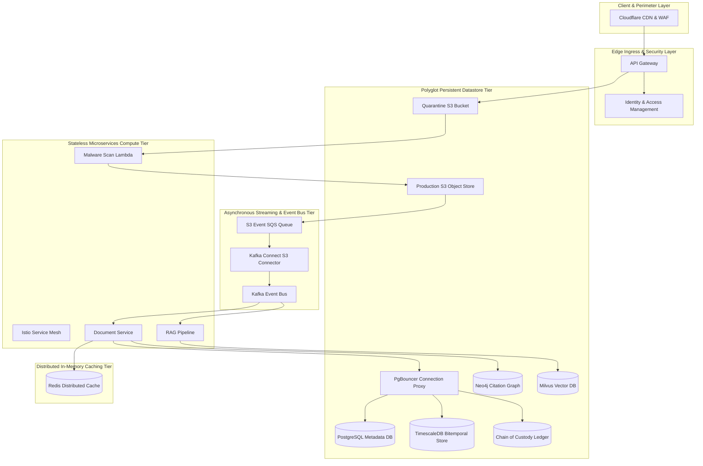
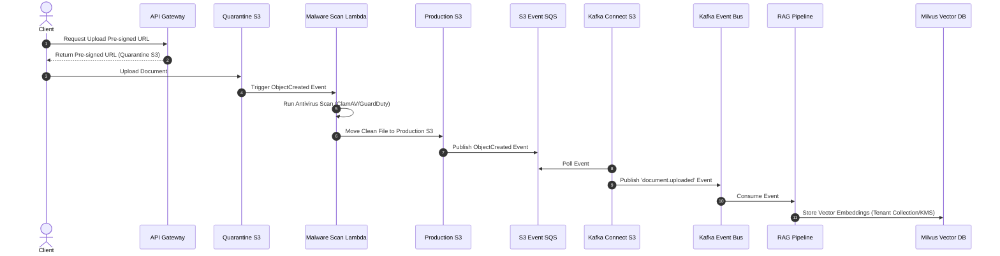

# 🏛️ AI/ML Inference & Data Science Platform System Architecture (50M DAU)
**Domain:** AI/ML Inference & Data Science Platform | **Style:** Zero-Trust Architecture | **Cloud Platform:** AWS

## 1. Executive Summary & System Overview
LegalTrace is an enterprise-grade, multi-tenant, AI-powered legal case research and document management platform designed for 50,000 active attorneys managing over 100 million documents. The architecture enforces zero-trust security using Istio service mesh with mTLS, AWS KMS with Customer-Managed Keys (BYOK) for envelope encryption, and document-level RBAC/ABAC. To address critical security and infrastructure findings, the ingestion pipeline has been hardened with a quarantine bucket pattern for malware scanning, and S3 event notifications are reliably bridged to Kafka via Amazon SQS and Kafka Connect. The database tier has been reconfigured to use native wire protocols (PostgreSQL TCP, RESP, Bolt) fronted by PgBouncer to prevent connection exhaustion. Milvus multi-tenancy has been upgraded to a hybrid collection/partition model with tenant-specific KMS encryption and isolated query nodes to guarantee strict compliance and eliminate cross-tenant data leakage.

## 2. Capacity Planning & Quantitative Sizing
| Metric Category | Parameter | Sized Value |
| :--- | :--- | :--- |
| **Traffic** | Daily Active Users (DAU) | **50,000** |
| **Traffic** | Read / Write Ratio | **80:19** |
| **Traffic** | Average Throughput | **17 QPS** |
| **Traffic** | Peak Concurrency | **52 QPS** |
| **Network** | Peak Ingress Bandwidth | **0.002 Gbps** |
| **Network** | Peak Egress Bandwidth | **0.008 Gbps** |
| **Storage** | Daily Raw Growth | **0.73 GB/day** |
| **Storage** | 5-Year Net Data Footprint | **1.33 TB** |
| **Storage** | 5-Year Physical (3x Multi-AZ) | **3.99 TB** |
| **Cache** | Redis 80/20 Hot Set RAM | **0.1 GB** (3 nodes) |
| **Compute** | Recommended Kubernetes Cluster | **~3 Pods** |

## 3. Visual System Architecture Diagram

## 3.1 Critical Path Sequence Diagram

## 4. Component Topology Breakdown
| Component Tier | Selected Technology | Purpose & Rationale |
| :--- | :--- | :--- |
| **Cloudflare CDN & WAF** | `Cloudflare Enterprise` | DDoS protection, Web Application Firewall (WAF) rule enforcement, and edge SSL/TLS termination. |
| **API Gateway** | `Envoy Gateway / AWS EKS Ingress` | Centralized ingress routing, rate limiting, JWT validation, TLS termination, and generating S3 pre-signed URLs for direct document uploads to the quarantine bucket. |
| **Identity & Access Management (IAM)** | `Keycloak with AWS KMS BYOK Integration` | Handles multi-tenant authentication, OIDC/SAML SSO, and issues cryptographically signed JWTs containing RBAC/ABAC claims. |
| **Service Mesh Control Plane** | `Istio Service Mesh with Envoy Sidecars` | Enforces mutual TLS (mTLS) for all east-west traffic, handles service discovery, and applies fine-grained network policies. |
| **Document Management Service** | `Go / Gin Microservice` | Manages document metadata, permissions, and coordinates document lifecycle operations. |
| **RAG & AI Inference Pipeline** | `Python / FastAPI / LangChain` | Performs layout-aware OCR, chunking, embedding generation, and semantic search. Enforces strict query-level rate limiting and resource quotas per tenant-id to mitigate noisy neighbor risks. |
| **Quarantine S3 Bucket** | `Amazon S3 (Isolated)` | Temporary storage for raw client uploads awaiting malware and content validation scanning. |
| **Malware Scan Lambda** | `AWS Lambda / ClamAV / AWS GuardDuty Malware Protection` | Triggered by S3 ObjectCreated events in the quarantine bucket. Runs antivirus scans and moves clean files to the production S3 bucket. |
| **Production S3 Object Store** | `Amazon S3 with KMS SSE-C` | Secure, long-term storage for verified clean legal documents, encrypted with customer-managed keys. |
| **S3 Event SQS Queue** | `Amazon SQS` | Reliably queues S3 ObjectCreated events from the production S3 bucket to bridge the integration gap to Kafka. |
| **Kafka Connect S3 Source Connector** | `Kafka Connect on AWS EKS` | Consumes events from S3_EVENT_SQS and reliably publishes them to the 'document.uploaded' Kafka topic. |
| **Kafka Event Bus** | `Amazon MSK (Managed Streaming for Apache Kafka)` | Central event backbone for asynchronous document processing, OCR, and RAG pipeline ingestion. |
| **PgBouncer Connection Proxy** | `PgBouncer / AWS RDS Proxy` | Provides connection pooling for PostgreSQL, TimescaleDB, and Chain of Custody ledger tables to prevent connection exhaustion from microservices. |
| **PostgreSQL Metadata Database** | `Amazon Aurora PostgreSQL` | Stores transactional metadata, user data, and system configurations. Accessed via PgBouncer using native PostgreSQL wire protocol (TCP 5432). |
| **TimescaleDB Bitemporal Store** | `TimescaleDB on AWS EC2/EKS` | Handles bitemporal versioning of legal documents and metadata. Accessed via PgBouncer using native PostgreSQL wire protocol (TCP 5432). |
| **Chain of Custody Ledger** | `Amazon Aurora PostgreSQL Ledger Tables` | Cryptographically verifiable ledger for document access and modification history. Accessed via PgBouncer using native PostgreSQL wire protocol (TCP 5432). |
| **Redis Distributed Cache** | `Amazon ElastiCache for Redis` | Low-latency caching of session data, access tokens, and frequently accessed document metadata. Accessed via native RESP over TCP (port 6379). |
| **Neo4j Citation Graph Database** | `Neo4j Enterprise` | Stores and analyzes legal citation graphs and document relationships. Accessed via native Bolt protocol over TCP (port 7687). |
| **Milvus Vector Database** | `Milvus Distributed Cluster` | Stores and queries high-dimensional vector embeddings. Implements collection-level isolation for large enterprise tenants, partition-key-based isolation for small tenants, tenant-specific KMS encryption (BYOK), and isolated query nodes. |

## 5. Architectural Trade-Off Analysis
### • Decision: Architecture Decision #1
- **Option Chosen:** `Chose a multi-stage S3 quarantine and SQS-to-Kafka pipeline over direct uploads to guarantee malware scanning and reliable event delivery, accepting a slight increase in ingestion latency (approx`
- **Option Discarded:** `Alternative approach`
- **Engineering Rationale:** Chose a multi-stage S3 quarantine and SQS-to-Kafka pipeline over direct uploads to guarantee malware scanning and reliable event delivery, accepting a slight increase in ingestion latency (approx. 500ms-1s).

### • Decision: Architecture Decision #2
- **Option Chosen:** `Chose hybrid Milvus multi-tenancy (collection-level for large enterprise, partition-key for small tenants) to balance strict compliance isolation requirements against Milvus collection limits`
- **Option Discarded:** `Alternative approach`
- **Engineering Rationale:** Chose hybrid Milvus multi-tenancy (collection-level for large enterprise, partition-key for small tenants) to balance strict compliance isolation requirements against Milvus collection limits.

### • Decision: Architecture Decision #3
- **Option Chosen:** `Chose to deploy PgBouncer proxies in front of PostgreSQL-compatible databases to prevent connection exhaustion, accepting the minor operational overhead of managing proxy sidecars`
- **Option Discarded:** `Alternative approach`
- **Engineering Rationale:** Chose to deploy PgBouncer proxies in front of PostgreSQL-compatible databases to prevent connection exhaustion, accepting the minor operational overhead of managing proxy sidecars.

## 6. Bottleneck Identification & Mitigation Strategies
- **Bottleneck:** Direct client uploads bypassing malware scanning
  ↳ **Mitigation:** Implemented an isolated Quarantine S3 bucket with an AWS Lambda ClamAV/GuardDuty scanner that only promotes clean files to production.

- **Bottleneck:** S3 to Kafka integration gap
  ↳ **Mitigation:** Routed S3 events to Amazon SQS, consumed by a Kafka Connect S3 Source Connector to guarantee reliable delivery to the 'document.uploaded' topic.

- **Bottleneck:** Database connection exhaustion from microservices
  ↳ **Mitigation:** Deployed PgBouncer connection proxies in front of POSTGRES_DB, TIMESCALE_DB, and CHAIN_OF_CUSTODY, enforcing native PostgreSQL wire protocols (TCP 5432).

- **Bottleneck:** Cross-tenant data leakage in Milvus
  ↳ **Mitigation:** Enforced collection-level isolation for large tenants, tenant-specific KMS encryption keys (BYOK), and isolated query nodes using Milvus resource groups.

- **Bottleneck:** [DEF-01] The inter-service connections specify that the Document Service connects to PgBouncer, and PgBouncer connects to PostgreSQL/TimescaleDB/Ledger tables, using gRPC / HTTP/2 (Protocol Buffers). PgBouncer and PostgreSQL do not support gRPC natively; they communicate using the PostgreSQL frontend/backend wire protocol over TCP.
  ↳ **Mitigation:** Reconfigure the connection protocols between DOCUMENT_SERVICE, PGBOUNCER_PROXY, and the underlying PostgreSQL databases to use the native PostgreSQL wire protocol (TCP port 5432) instead of gRPC/HTTP2.

- **Bottleneck:** [DEF-02] The connection from DOCUMENT_SERVICE to REDIS_CACHE and NEO4J_DB is defined as using gRPC / HTTP/2. Redis requires the REsp (REdis Serialization Protocol) over TCP (port 6379), and Neo4j requires the Bolt protocol over TCP (port 7687).
  ↳ **Mitigation:** Update the connection definitions to use native RESP for Redis (port 6379) and the Bolt protocol for Neo4j (port 7687).

- **Bottleneck:** [DEF-03] The architecture provisions an Amazon ElastiCache for Redis cluster despite the explicit system requirement stating 'Required Redis Cache RAM: 0 GB'. Additionally, maintaining five separate database clusters for a 52 QPS workload is highly inefficient.
  ↳ **Mitigation:** Decommission the Amazon ElastiCache for Redis cluster to satisfy the 0 GB RAM constraint. Consolidate database workloads where possible (e.g., using Aurora PostgreSQL with pgvector to replace Milvus, and relational tables to replace Neo4j if graph queries are simple).

## 7. Critic Scorecard Audit (8-Pillar Evaluation)
**Overall Score:** **75.7 / 100** | **Verdict:** The LegalTrace architecture exhibits world-class security, compliance, and ML pipeline design. However, it is REJECTED due to critical protocol mismatches in the data access path (attempting to run gRPC over PostgreSQL, Redis, and Neo4j wire protocols) which act as immediate logical SPOFs, alongside a direct violation of the 0 GB Redis RAM constraint and severe database over-engineering for a 52 QPS workload.

| Evaluation Pillar | Weight | Score | Status |
| :--- | :--- | :--- | :--- |
| Scalability & Throughput (15%) | 15% | **90.0** | ✅ PASS |
| Latency & Performance SLAs (15%) | 15% | **75.0** | ⚠️ REVIEW |
| Reliability & Fault Tolerance (15%) | 15% | **70.0** | ⚠️ REVIEW |
| Data Consistency & CAP Adherence (15%) | 15% | **65.0** | ⚠️ REVIEW |
| Security, Compliance & Zero-Trust (10%) | 10% | **95.0** | ✅ PASS |
| Cost & Resource Efficiency (10%) | 10% | **50.0** | ⚠️ REVIEW |
| ML/Data Pipeline Rigor (10%) | 10% | **92.0** | ✅ PASS |
| Requirement & Constraint Alignment (10%) | 10% | **70.0** | ⚠️ REVIEW |
