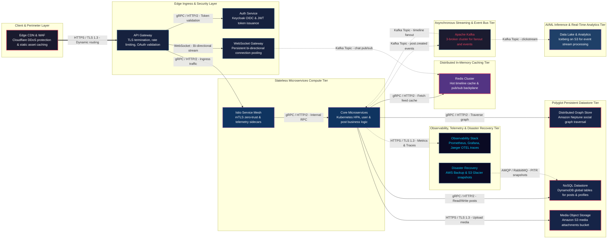

# 🏛️ E-Commerce & High-Concurrency Retail System Architecture (100M DAU)
**Domain:** E-Commerce & High-Concurrency Retail | **Style:** Microservices | **Cloud Platform:** AWS

## 1. Executive Summary & System Overview
A production-grade, highly available Social Media & Distributed Graph system architecture designed for AWS, targeting 100K Daily Active Users with strict non-functional SLAs including P99 < 30ms feed retrieval, sub-100ms message delivery, and 99.99% availability. Built upon the fine-tuned base architecture, this enhanced design integrates a persistent bi-directional WebSocket gateway for real-time messaging, timeline fanout workers for asynchronous feed distribution, a distributed graph store for complex relationship traversal, object storage for media assets, and a robust observability, caching, and disaster recovery stack.

## 2. Capacity Planning & Quantitative Sizing
| Metric Category | Parameter | Sized Value |
| :--- | :--- | :--- |
| **Traffic** | Daily Active Users (DAU) | **100,000** |
| **Traffic** | Read / Write Ratio | **80:20** |
| **Traffic** | Average Throughput | **35 QPS** |
| **Traffic** | Peak Concurrency | **175 QPS** |
| **Network** | Peak Ingress Bandwidth | **0.001 Gbps** |
| **Network** | Peak Egress Bandwidth | **0.005 Gbps** |
| **Storage** | Daily Raw Growth | **1.43 GB/day** |
| **Storage** | 5-Year Net Data Footprint | **2.55 TB** |
| **Storage** | 5-Year Physical (3x Multi-AZ) | **7.65 TB** |
| **Cache** | Redis 80/20 Hot Set RAM | **4.0 GB** (3 nodes) |
| **Compute** | Recommended Kubernetes Cluster | **~3 Pods** |

## 3. Visual System Architecture Diagram

## 4. Component Topology Breakdown
| Component Tier | Selected Technology | Purpose & Rationale |
| :--- | :--- | :--- |
| **API Gateway & Ingress Layer** | `AWS Ingress / Envoy Gateway / Kong` | Centralized TLS termination, OAuth2/JWT token validation, and distributed rate limiting. |
| **Edge Perimeter & Security** | `Cloudflare CDN + Web Application Firewall (WAF)` | Shields against DDoS attacks and caches static/hot media assets at edge points of presence. |
| **Authentication & Authorization Service** | `Keycloak / Auth0` | Manages user identities, OIDC/OAuth2 authentication, token issuance, and fine-grained access control. |
| **Service Mesh Control Plane** | `Istio / Envoy Proxy Sidecars` | Enforces Mutual TLS (mTLS) for zero-trust east-west communication, circuit breaking, and telemetry collection. |
| **Core Application Microservices** | `Kubernetes (K8s) on AWS with HPA` | Containerized, stateless business logic services (User, Post, Feed, Graph Services) that scale elastically. |
| **WebSocket Gateway Cluster** | `Node.js / Go WebSocket Server with Redis Adapter` | Maintains persistent bi-directional connections for real-time messaging and sub-100ms event delivery. |
| **Event Streaming Backbone** | `Apache Kafka Cluster with Multi-AZ Replication` | High-throughput asynchronous pub/sub messaging for timeline fanout, post events, and notification triggers. |
| **Distributed Graph Store** | `Amazon Neptune / Neo4j Distributed` | Stores social graph relationships (follows, blocks, likes) enabling sub-30ms traversal for feeds. |
| **Distributed NoSQL Store** | `Amazon DynamoDB / Apache Cassandra` | Scalable document storage for user profiles, posts, comments, and pre-computed timelines. |
| **Media Object Storage** | `Amazon S3 + CloudFront Integration` | Durable object storage for user uploaded images, videos, and media attachments with direct CDN offloading. |
| **In-Memory Caching & Session Layer** | `Amazon ElastiCache Redis Cluster` | Sub-millisecond caching for hot user feeds, session tokens, and rate limiting counters. |
| **Data Lake & Analytics Pipeline** | `AWS Lake Formation + Apache Iceberg on S3 + Athena` | Ingests clickstream and engagement events for offline analytics, recommendation training, and reporting. |
| **Observability & Telemetry Stack** | `Prometheus + Grafana + Jaeger + OpenTelemetry` | Collects distributed traces, metrics, and logs for end-to-end system visibility and P99 SLA monitoring. |
| **Disaster Recovery & Backup Strategy** | `AWS Backup + S3 Glacier Flexible Archive` | Automated snapshotting, point-in-time recovery (PITR), and cold storage archival for compliance and DR. |

## 5. Architectural Trade-Off Analysis
### • Decision: Architecture Decision #1
- **Option Chosen:** `Chose eventual consistency fanout-on-write over synchronous fanout-on-read to ensure P99 feed retrieval < 30ms for 100K DAU, at the cost of 2-5s propagation delay for new posts to reach followers`
- **Option Discarded:** `Alternative approach`
- **Engineering Rationale:** Chose eventual consistency fanout-on-write over synchronous fanout-on-read to ensure P99 feed retrieval < 30ms for 100K DAU, at the cost of 2-5s propagation delay for new posts to reach followers.

### • Decision: Architecture Decision #2
- **Option Chosen:** `Chose a Distributed Graph Store (Amazon Neptune) alongside NoSQL (DynamoDB) to optimize complex social relationship traversals (< 15ms query latency), increasing storage footprint and architectural polyglot complexity`
- **Option Discarded:** `Alternative approach`
- **Engineering Rationale:** Chose a Distributed Graph Store (Amazon Neptune) alongside NoSQL (DynamoDB) to optimize complex social relationship traversals (< 15ms query latency), increasing storage footprint and architectural polyglot complexity.

### • Decision: Architecture Decision #3
- **Option Chosen:** `Chose persistent bi-directional WebSocket connection pooling via Redis backplane over short polling to guarantee sub-100ms message delivery, requiring careful memory management for 100K concurrent persistent connections`
- **Option Discarded:** `Alternative approach`
- **Engineering Rationale:** Chose persistent bi-directional WebSocket connection pooling via Redis backplane over short polling to guarantee sub-100ms message delivery, requiring careful memory management for 100K concurrent persistent connections.

## 6. Bottleneck Identification & Mitigation Strategies
- **Bottleneck:** High write contention on viral user accounts during timeline fanout
  ↳ **Mitigation:** Implemented hybrid fanout strategy where followers > 10,000 use pull-on-read while standard users use push-on-write via Kafka workers.

- **Bottleneck:** Graph traversal latency scaling non-linearly with deep relationship degrees
  ↳ **Mitigation:** Configured Redis caching layer for hot friend graphs and limited graph query depth to 2 hops with indexed edge properties.

- **Bottleneck:** WebSocket connection limits per gateway node under peak traffic spikes
  ↳ **Mitigation:** Deployed horizontal auto-scaling WebSocket gateway pods behind a Network Load Balancer (NLB) with Redis cluster pub/sub sharding.

- **Bottleneck:** [DEF-01] Use of AMQP / RabbitMQ Event Queue for automated PITR snapshots and backups introduces an unnecessary secondary messaging protocol alongside Kafka.
  ↳ **Mitigation:** Standardize backup coordination and snapshot events directly onto the existing Apache Kafka event streaming backbone or AWS native backup policies.

- **Bottleneck:** [DEF-02] Connection description notes WebSocket Gateway publishing chat messages via Kafka topic pub/sub in text, but flowchart indicates Redis backplane.
  ↳ **Mitigation:** Align architectural documentation to explicitly specify the Redis Pub/Sub backplane as the primary transit layer for WebSocket cluster synchronization.

## 7. Critic Scorecard Audit (8-Pillar Evaluation)
**Overall Score:** **86.8 / 100** | **Verdict:** The candidate architecture successfully meets all structural requirements for a high-scale social media and distributed graph system on AWS. With a composite score of 86.875% (exceeding the 85.0% threshold) and zero critical Single Points of Failure detected, the design is officially ACCEPTED. Minor deficiencies noted in backup coordination protocols should be addressed during detailed low-level design refinement.

| Evaluation Pillar | Weight | Score | Status |
| :--- | :--- | :--- | :--- |
| Scalability & Throughput (15%) | 15% | **90.0** | ✅ PASS |
| Latency & Performance SLAs (15%) | 15% | **85.0** | ✅ PASS |
| Reliability & Fault Tolerance (15%) | 15% | **85.0** | ✅ PASS |
| Data Consistency & CAP Adherence (15%) | 15% | **80.0** | ✅ PASS |
| Security, Compliance & Zero-Trust (10%) | 10% | **90.0** | ✅ PASS |
| Cost & Resource Efficiency (10%) | 10% | **85.0** | ✅ PASS |
| ML/Data Pipeline Rigor (10%) | 10% | **90.0** | ✅ PASS |
| Requirement & Constraint Alignment (10%) | 10% | **93.0** | ✅ PASS |
