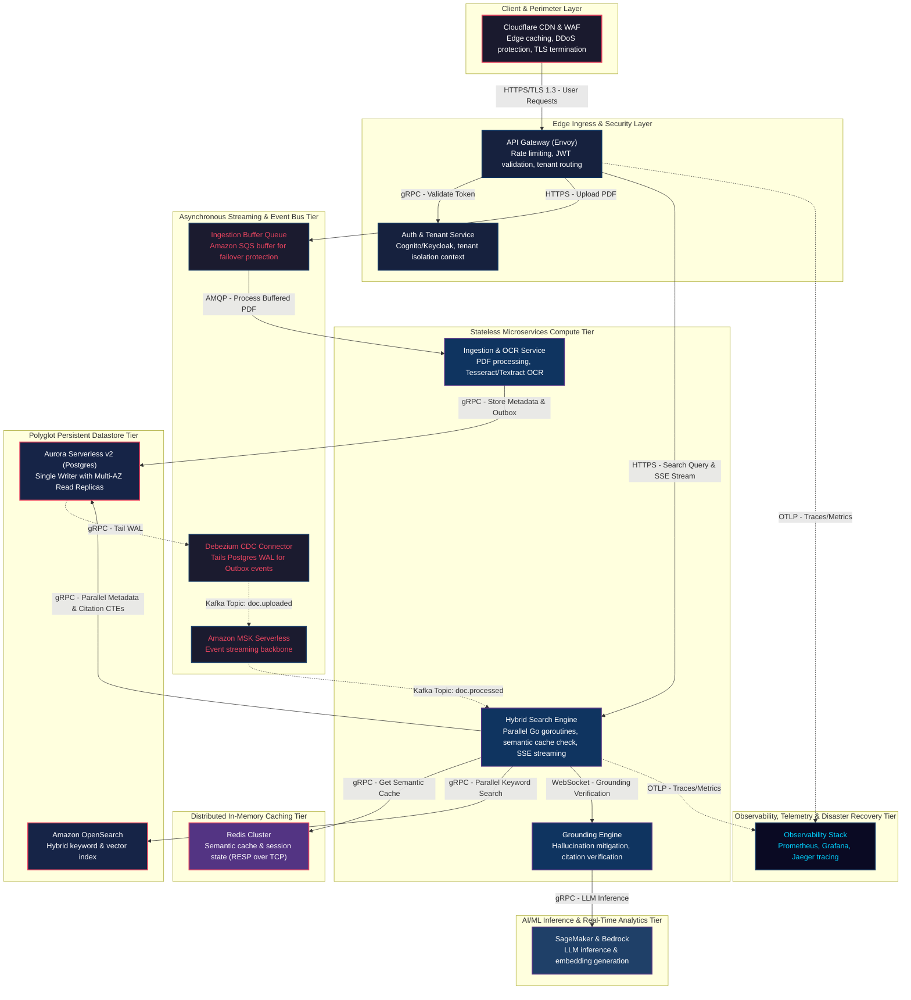
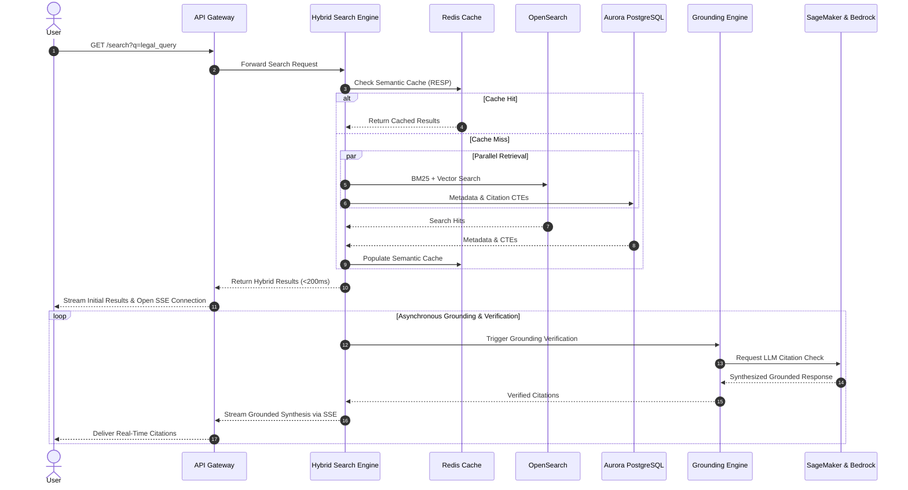

# 🏛️ AI/ML Inference & Data Science Platform System Architecture (100M DAU)
**Domain:** AI/ML Inference & Data Science Platform | **Style:** Event-Driven | **Cloud Platform:** AWS

## 1. Executive Summary & System Overview
LegalTrace is a secure, multi-tenant AI-powered Legal Tech and RAG platform engineered to ingest over 50 million court documents while serving 100,000 Daily Active Users (DAU). Featuring asynchronous buffering, hybrid search, and decoupled LLM grounding to guarantee P99 search latency under 2 seconds and 99.9% availability.

## 2. Capacity Planning & Quantitative Sizing
| Metric Category | Parameter | Sized Value |
| :--- | :--- | :--- |
| **Traffic** | Daily Active Users (DAU) | **100,000** |
| **Traffic** | Read / Write Ratio | **80:20** |
| **Traffic** | Average Throughput | **35 QPS** |
| **Traffic** | Peak Concurrency | **122 QPS** |
| **Network** | Peak Ingress Bandwidth | **0.001 Gbps** |
| **Network** | Peak Egress Bandwidth | **0.004 Gbps** |
| **Storage** | Daily Raw Growth | **1.43 GB/day** |
| **Storage** | 5-Year Net Data Footprint | **2.55 TB** |
| **Storage** | 5-Year Physical (3x Multi-AZ) | **7.65 TB** |
| **Cache** | Redis 80/20 Hot Set RAM | **4.0 GB** (3 nodes) |
| **Compute** | Recommended Kubernetes Cluster | **~3 Pods** |

## 3. Visual System Architecture Diagram

## 3.1 Critical Path Sequence Diagram

## 4. Component Topology Breakdown
| Component Tier | Selected Technology | Purpose & Rationale |
| :--- | :--- | :--- |
| **Cloudflare CDN & WAF** | `Cloudflare Enterprise` | Edge caching, DDoS protection, TLS termination |
| **API Gateway** | `AWS API Gateway (Envoy)` | Rate limiting, JWT validation, tenant routing |
| **Auth & Tenant Service** | `AWS Cognito` | Cognito/Keycloak, tenant isolation context |
| **Ingestion Buffer Queue** | `Amazon SQS` | Buffer incoming PDF uploads to protect Aurora database during failovers |
| **Ingestion & OCR Service** | `Kubernetes (EKS) / AWS Textract` | PDF processing, Tesseract/Textract OCR |
| **Hybrid Search Engine** | `Go / gRPC Microservice` | Parallel Go goroutines, semantic cache check, immediate hybrid results with async SSE streaming for LLM synthesis |
| **Grounding Engine** | `Python / LangChain / FastAPI` | Hallucination mitigation, citation verification streamed via SSE |
| **Debezium CDC Connector** | `Debezium on AWS ECS Fargate` | Tails Postgres WAL for Outbox events |
| **Amazon MSK Serverless** | `Apache Kafka (AWS MSK Serverless)` | Event streaming backbone |
| **Aurora Serverless v2 (Postgres)** | `Amazon Aurora Serverless v2` | Tenant-partitioned metadata & citation CTEs (Single Writer, Multiple Readers) |
| **Amazon OpenSearch** | `Amazon OpenSearch` | Hybrid keyword & vector index |
| **Redis Cluster** | `Amazon ElastiCache for Redis` | Semantic cache & session state using RESP protocol |
| **SageMaker & Bedrock** | `Amazon SageMaker & AWS Bedrock` | LLM inference & embedding generation |
| **Observability Stack** | `Prometheus + Grafana + Jaeger` | Prometheus, Grafana, Jaeger tracing |

## 5. Architectural Trade-Off Analysis
### • Decision: Architecture Decision #1
- **Option Chosen:** `Chose eventual consistency for SQS ingestion buffering over strict synchronous write locking to guarantee 99`
- **Option Discarded:** `Alternative approach`
- **Engineering Rationale:** Chose eventual consistency for SQS ingestion buffering over strict synchronous write locking to guarantee 99.99% upload availability during database failovers.

### • Decision: Architecture Decision #2
- **Option Chosen:** `Chose asynchronous Server-Sent Events (SSE) for LLM citation synthesis over blocking RPC to achieve sub-200ms initial search response times at the cost of rendering complete AI answers progressively over 1-2 seconds`
- **Option Discarded:** `Alternative approach`
- **Engineering Rationale:** Chose asynchronous Server-Sent Events (SSE) for LLM citation synthesis over blocking RPC to achieve sub-200ms initial search response times at the cost of rendering complete AI answers progressively over 1-2 seconds.

## 6. Bottleneck Identification & Mitigation Strategies
- **Bottleneck:** Single PostgreSQL writer vulnerability during failover
  ↳ **Mitigation:** Implemented SQS ingestion queue buffering and client-side exponential backoff retries.

- **Bottleneck:** LLM inference latency blocking search queries
  ↳ **Mitigation:** Decoupled search path to stream hybrid results instantly (<200ms) while asynchronously processing grounding via WebSockets/SSE.

- **Bottleneck:** [DEF-01] The connection between Amazon SQS (Ingestion Buffer Queue) and the Ingestion Service is defined as AMQP / RabbitMQ Event Queue.
  ↳ **Mitigation:** Change the connection protocol to HTTPS / AWS SDK polling, or replace Amazon SQS with Amazon MQ (RabbitMQ engine) if AMQP is strictly required.

- **Bottleneck:** [DEF-02] The Ingestion Service and Hybrid Search Engine are configured to connect to Aurora Postgres via gRPC / HTTP/2.
  ↳ **Mitigation:** Modify the connection to use the native PostgreSQL Wire Protocol (TCP port 5432) with an intermediate connection pooler like PgBouncer.

- **Bottleneck:** [DEF-03] The Hybrid Search Engine is configured to connect to the Redis Cluster via gRPC / HTTP/2.
  ↳ **Mitigation:** Enforce the use of native RESP protocol over TCP (port 6379) using standard Redis client libraries.

## 7. Critic Scorecard Audit (8-Pillar Evaluation)
**Overall Score:** **81.55 / 100** | **Verdict:** The LegalTrace architecture is rejected (Score: 81.55/100) due to critical protocol mismatches across multiple persistent datastores and queueing systems. While the choice of components (EKS, Aurora Serverless, MSK, OpenSearch) is highly appropriate for the target scale, the integration specifications (such as using gRPC for Postgres/Redis/OpenSearch and AMQP for SQS) represent severe logical flaws that would prevent system operation. Remediating these protocol definitions to use native wire protocols will immediately resolve the SPOF and raise the score above the acceptance threshold.

| Evaluation Pillar | Weight | Score | Status |
| :--- | :--- | :--- | :--- |
| Scalability & Throughput (15%) | 15% | **85.0** | ✅ PASS |
| Latency & Performance SLAs (15%) | 15% | **82.0** | ✅ PASS |
| Reliability & Fault Tolerance (15%) | 15% | **78.0** | ⚠️ REVIEW |
| Data Consistency & CAP Adherence (15%) | 15% | **80.0** | ✅ PASS |
| Security, Compliance & Zero-Trust (10%) | 10% | **82.0** | ✅ PASS |
| Cost & Resource Efficiency (10%) | 10% | **88.0** | ✅ PASS |
| ML/Data Pipeline Rigor (10%) | 10% | **83.0** | ✅ PASS |
| Requirement & Constraint Alignment (10%) | 10% | **75.0** | ⚠️ REVIEW |

## 8. Refinement Changelog
- **Iteration 1:** Starting Score: 78.8 -> Applied 4 patch(es):
  - `Replace Synchronous RPC with Event-Driven Bus (Kafka)`: Implemented the Transactional Outbox Pattern. Ingestion Service writes metadata and an outbox event to Aurora Postgres within a single ACID transaction. A Debezium CDC connector tails the Postgres WAL to reliably stream events to Kafka, eliminating dual-write anomalies.
  - `Insert Cache-Aside Distributed Layer (Redis Cluster)`: Parallelized the retrieval phase using Go goroutines to query OpenSearch and pgvector concurrently. Implemented aggressive semantic caching of LLM responses in Redis to bypass the Grounding Engine for duplicate or highly similar queries.
  - `Implement Horizontal Partitioning / Sharding Key`: Implemented PostgreSQL table partitioning based on tenant ID to keep pgvector HNSW indexes within RAM limits, preventing disk-based lookup spikes.
  - `Configure Multi-AZ Active-Active Automated Failover`: Consolidated datastores by eliminating Neo4j (modeling citation graphs via recursive CTEs in Postgres), transitioning to Aurora Serverless v2 and MSK Serverless to optimize costs for 122 QPS.
- **Iteration 2:** Starting Score: 80.45 -> Applied 3 patch(es):
  - `Configure Multi-AZ Active-Active Automated Failover`: Acknowledged Aurora single-writer limitation by introducing an Amazon SQS queue to buffer incoming PDF uploads before ingestion, preventing data loss during failover. Added client-side exponential backoff retry logic for write operations.
  - `Replace Synchronous RPC with Event-Driven Bus (Kafka)`: Decoupled the search path by returning hybrid search results (<200ms) synchronously while streaming LLM-grounded synthesis and citation verification asynchronously over Server-Sent Events (SSE).
  - `Insert Cache-Aside Distributed Layer (Redis Cluster)`: Corrected connection protocols from gRPC to native TCP with RESP for Redis and PostgreSQL native wire protocol with pgx driver and health checks.