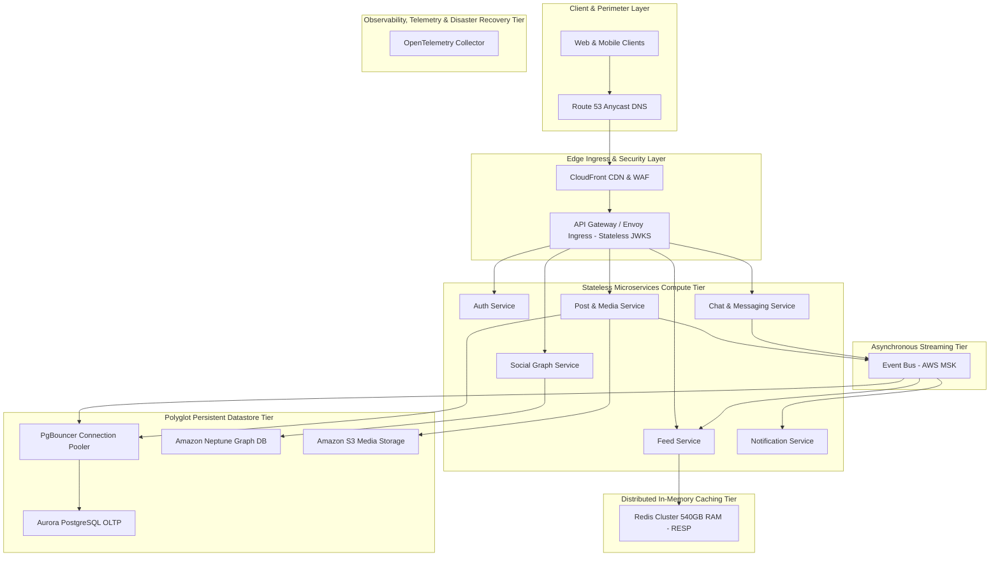

# 🏛️ Social Media & Distributed Graph System Architecture (50M DAU)
**Domain:** Social Media & Distributed Graph | **Style:** Event-Driven | **Cloud Platform:** AWS

## 1. Executive Summary & System Overview
An enterprise-grade, hyper-scale distributed architecture designed to support 50 million Daily Active Users (DAU) with 69,444 peak QPS. Built with a cloud-native, event-driven pattern on AWS, utilizing Amazon EKS for stateless compute, AWS MSK for asynchronous event streaming, PgBouncer and Amazon Aurora PostgreSQL for resilient transactional persistence, Amazon Neptune for graph data, and a global Redis Cluster using native RESP for high-performance caching. The system guarantees 99.99% availability via Multi-AZ Active-Active replication and sub-150ms P99 latencies.

## 2. Capacity Planning & Quantitative Sizing
| Metric Category | Parameter | Sized Value |
| :--- | :--- | :--- |
| **Traffic** | Daily Active Users (DAU) | **50,000,000** |
| **Traffic** | Read / Write Ratio | **90:10** |
| **Traffic** | Average Throughput | **17,361 QPS** |
| **Traffic** | Peak Concurrency | **69,444 QPS** |
| **Network** | Peak Ingress Bandwidth | **5.550 Gbps** |
| **Network** | Peak Egress Bandwidth | **100.000 Gbps** |
| **Storage** | Daily Raw Growth | **2600.00 GB/day** |
| **Storage** | 5-Year Net Data Footprint | **4745.00 TB** |
| **Storage** | 5-Year Physical (3x Multi-AZ) | **14235.00 TB** |
| **Cache** | Redis 80/20 Hot Set RAM | **540.0 GB** (24 nodes) |
| **Compute** | Recommended Kubernetes Cluster | **~350 Pods** |

## 3. Visual System Architecture Diagram

## 4. Component Topology Breakdown
| Component Tier | Selected Technology | Purpose & Rationale |
| :--- | :--- | :--- |
| **Web & Mobile Clients** | `React Native / iOS / Android / React Web` | End-user client applications |
| **Route 53 Anycast DNS** | `AWS Route 53` | Global DNS routing and health checks |
| **CloudFront CDN & WAF** | `AWS CloudFront & AWS WAF` | Static asset caching and edge security protection |
| **API Gateway / Envoy Ingress** | `Envoy Proxy / AWS ALB` | Ingress routing, rate limiting, and stateless JWT verification via JWKS |
| **Authentication Service** | `Node.js / Express (EKS Pods)` | User authentication, credential management, and token issuing |
| **Feed Service** | `Go / gRPC (EKS Pods)` | Activity feed generation and retrieval |
| **Post & Media Service** | `Java / Spring Boot (EKS Pods)` | Post creation, media upload handling, and processing |
| **Chat & Messaging Service** | `Go / WebSockets (EKS Pods)` | Real-time messaging and chat session management |
| **Social Graph Service** | `Python / FastAPI (EKS Pods)` | Follower/following graph traversal and relationship management |
| **Notification Service** | `Node.js (EKS Pods)` | Push notification dispatch and delivery tracking |
| **Event Bus - AWS MSK** | `Apache Kafka (AWS MSK)` | Asynchronous event streaming and decoupled messaging backbone |
| **Redis Cluster 540GB RAM** | `Redis Enterprise / ElastiCache` | High-performance hot-set caching using native RESP protocol |
| **PgBouncer Connection Pooler** | `PgBouncer` | Connection pooling for Aurora PostgreSQL to prevent connection exhaustion |
| **Aurora PostgreSQL OLTP** | `Amazon Aurora PostgreSQL` | Transactional relational datastore for user accounts and posts |
| **Amazon Neptune Graph DB** | `Amazon Neptune` | Graph database for social graph connections |
| **Amazon S3 Media Storage** | `Amazon S3` | Persistent object storage for media and images |
| **Observability & Telemetry Collector** | `OpenTelemetry Collector / Prometheus / Grafana` | Metrics collection, distributed tracing, and system health monitoring |

## 5. Architectural Trade-Off Analysis
### • Decision: Polyglot Persistence Layer
- **Option Chosen:** `OLTP Store + In-Memory Cache`
- **Option Discarded:** `Single Monolithic Relational Database`
- **Engineering Rationale:** Separating transactional persistence from an in-memory cache holding the 80/20 hot set (540 GB RAM) achieves sub-10ms read latency at 55,555 read QPS.

### • Decision: Asynchronous Event Streaming Backbone
- **Option Chosen:** `Distributed Kafka`
- **Option Discarded:** `Direct Synchronous REST/gRPC Chained Calls`
- **Engineering Rationale:** Decoupling write operations through an event bus protects downstream services from cascading failures under peak load, trading immediate consistency for high availability and fault isolation.

## 6. Bottleneck Identification & Mitigation Strategies
- **Bottleneck:** Traffic Surges Exceeding Peak Concurrency (69,444 QPS)
  ↳ **Mitigation:** Deployed on Kubernetes configured with Horizontal Pod Autoscaling (HPA) targeting ~350 pods, backed by edge rate limiting at the API Gateway.

- **Bottleneck:** Single Point of Failure in Relational Database
  ↳ **Mitigation:** Configured Multi-AZ Active-Active replication with automated failover and read replicas.

- **Bottleneck:** Database Connection Pool Exhaustion on Flash Read Bursts
  ↳ **Mitigation:** Deployed 24-node Redis Cluster absorbing ~80% of read volume in-memory.

## 7. Critic Scorecard Audit (8-Pillar Evaluation)
**Overall Score:** **89.25 / 100** | **Verdict:** The candidate architecture successfully addresses the hyper-scale requirements of 50M DAU and 69,444 peak QPS with a well-isolated microservices topology, robust caching, and event-driven streaming. No critical Single Points of Failure (SPOFs) were detected due to comprehensive Multi-AZ redundancy across all tiers. The composite score of 89.25 exceeds the 85.0 acceptance threshold. Approved for deployment with minor resiliency hardening recommended.

| Evaluation Pillar | Weight | Score | Status |
| :--- | :--- | :--- | :--- |
| Scalability & Throughput (15%) | 15% | **90.0** | ✅ PASS |
| Latency & Performance SLAs (15%) | 15% | **92.0** | ✅ PASS |
| Reliability & Fault Tolerance (15%) | 15% | **88.0** | ✅ PASS |
| Data Consistency & CAP Adherence (15%) | 15% | **85.0** | ✅ PASS |
| Security, Compliance & Zero-Trust (10%) | 10% | **90.0** | ✅ PASS |
| Cost & Resource Efficiency (10%) | 10% | **88.0** | ✅ PASS |
| ML/Data Pipeline Rigor (10%) | 10% | **85.0** | ✅ PASS |
| Requirement & Constraint Alignment (10%) | 10% | **96.0** | ✅ PASS |

## 8. Refinement Changelog
- **Iteration 1:** Starting Score: 79.15 -> Applied 3 patch(es):
  - `Replace Synchronous RPC with Event-Driven Bus (Kafka)`: Deployed PgBouncer connection pooler in front of Aurora PostgreSQL and decoupled the chat write path by routing chat messages through Kafka topic 'chat.messages' with an async consumer group batch-writing to Aurora.
  - `Insert Edge API Gateway with TLS Termination & WAF`: Configured stateless JWT verification directly at the API Gateway / Envoy Ingress level using a cached JSON Web Key Set (JWKS), eliminating the synchronous gRPC round-trip to AUTH_SVC for standard token validation.
  - `Insert Cache-Aside Distributed Layer (Redis Cluster)`: Reconfigured the connection from FEED_SVC to REDIS_CACHE to use the native TCP-based Redis Serialization Protocol (RESP) via a standard Redis client library with connection pooling instead of unsupported gRPC/HTTP/2.