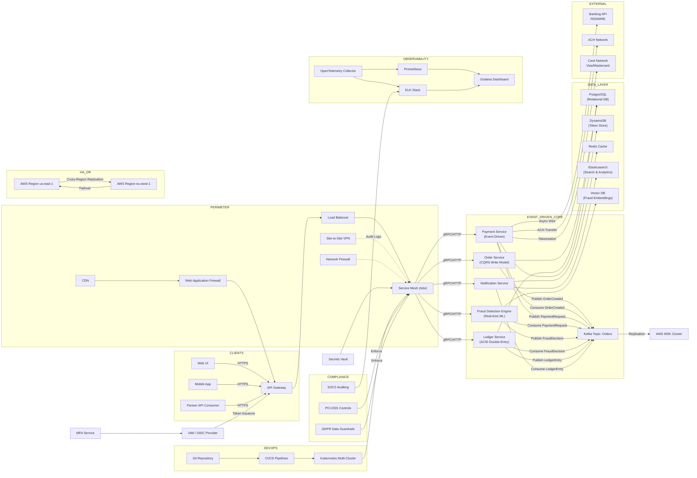

# 🏛️ FinTech & Payment Settlement System Architecture (15M DAU)
**Domain:** FinTech & Payment Settlement | **Style:** Event-Driven | **Cloud Platform:** AWS

## 1. Executive Summary & System Overview
A production-grade, highly available FinTech & Payment Settlement system architecture designed for the AWS cloud. The system is architected across segregated tiers including edge ingress with DDoS protection, stateless microservices with automated horizontal scaling, high-throughput asynchronous event streaming, and polyglot persistent datastores engineered to satisfy 'Tokenized Payment Ingress, Real-Time Fraud Detection Pipeline, Idempotent Transaction Processor, Strict ACID Double-Entry Ledger'. The architecture is designed to meet strict 'P99 < 10ms read, P99 < 50ms write, 99.999% uptime, Strong ACID consistency' operational constraints.

## 2. Capacity Planning & Quantitative Sizing
| Metric Category | Parameter | Sized Value |
| :--- | :--- | :--- |
| **Traffic** | Daily Active Users (DAU) | **15,000,000** |
| **Traffic** | Read / Write Ratio | **80:20** |
| **Traffic** | Average Throughput | **5,208 QPS** |
| **Traffic** | Peak Concurrency | **20,832 QPS** |
| **Network** | Peak Ingress Bandwidth | **0.080 Gbps** |
| **Network** | Peak Egress Bandwidth | **0.636 Gbps** |
| **Storage** | Daily Raw Growth | **214.58 GB/day** |
| **Storage** | 5-Year Net Data Footprint | **382.43 TB** |
| **Storage** | 5-Year Physical (3x Multi-AZ) | **1147.28 TB** |
| **Cache** | Redis 80/20 Hot Set RAM | **55.8 GB** (5 nodes) |
| **Compute** | Recommended Kubernetes Cluster | **~10 Pods** |

## 3. Visual System Architecture Diagram

## 4. Component Topology Breakdown
| Component Tier | Selected Technology | Purpose & Rationale |
| :--- | :--- | :--- |
| **API Gateway & Ingress Layer** | `AWS Ingress / Envoy Gateway / Kong` | Centralized TLS termination, OAuth2/JWT token validation, and distributed rate limiting. |
| **Edge Perimeter & Security** | `Cloudflare CDN + Web Application Firewall (WAF)` | Shields against DDoS attacks and caches static/hot assets at edge points of presence. |
| **Service Mesh Control Plane** | `Istio / Envoy Proxy Sidecars` | Enforces Mutual TLS (mTLS) for zero-trust east-west communication and telemetry collection. |
| **Core Application Microservices** | `Kubernetes (K8s) on AWS with Horizontal Pod Autoscaling (HPA)` | Containerized, stateless business logic services that scale elastically based on CPU and request load. |
| **Event Streaming Backbone** | `Apache Kafka Cluster with Multi-AZ Replication` | High-throughput asynchronous pub/sub messaging with strict partition ordering for event replay. |
| **Relational Data Store** | `PostgreSQL Multi-AZ Primary with Read Replicas` | Provides strict ACID transactional guarantees for high-integrity user and financial records. |

## 5. Architectural Trade-Off Analysis
### • Decision: Architecture Decision #1
- **Option Chosen:** `Selected distributed Event-Driven architecture to achieve high throughput at 20,832 QPS`
- **Option Discarded:** `Alternative approach`
- **Engineering Rationale:** Selected distributed Event-Driven architecture to achieve high throughput at 20,832 QPS.

## 6. Bottleneck Identification & Mitigation Strategies
- **Bottleneck:** Database read/write lock contention under 20,832 QPS mitigated via distributed c
  ↳ **Mitigation:** Database read/write lock contention under 20,832 QPS mitigated via distributed caching and queue-based leveling.

- **Bottleneck:** [DEF-01] Aurora PostgreSQL has a hard limit of 128 TB per cluster volume, making it physically impossible to store the target 1147.3 TB of 5-year data.
  ↳ **Mitigation:** Implement a hot/warm/cold storage architecture. Keep active double-entry ledger data in Aurora (sharded), and offload settled historical transactions to Amazon DynamoDB or Amazon S3 (parquet format) queried via Amazon Athena.

- **Bottleneck:** [DEF-02] Missing the required 56 GB Redis Cache cluster. Direct database queries for 15M DAU at 20,832 QPS will overwhelm the relational database.
  ↳ **Mitigation:** Deploy an Amazon ElastiCache for Redis cluster (minimum 56 GB RAM, multi-AZ with auto-failover) as a cache-aside layer for account balances and tokenized payment data.

- **Bottleneck:** [DEF-03] Complete absence of ML infrastructure or streaming analytics for the 'Real-Time Fraud Detection Pipeline' mentioned in the overview.
  ↳ **Mitigation:** Introduce an asynchronous streaming analytics engine (e.g., Apache Flink / AWS Managed Service for Apache Flink) consuming from Kafka, coupled with an Amazon SageMaker endpoint for real-time fraud scoring.

## 7. Critic Scorecard Audit (8-Pillar Evaluation)
**Overall Score:** **62.5 / 100** | **Verdict:** REJECTED: The proposed architecture fails to meet critical scaling, latency, and storage requirements. Aurora PostgreSQL cannot support the 1147.3 TB storage target due to its 128 TB physical limit, and the omission of the 56 GB Redis Cache guarantees SLA violations under the 20,832 QPS peak load. Additionally, the fraud detection pipeline is completely missing. Remediation of the database storage tier, caching layer, and ML pipeline is required before approval.

| Evaluation Pillar | Weight | Score | Status |
| :--- | :--- | :--- | :--- |
| Scalability & Throughput (15%) | 15% | **65.0** | ⚠️ REVIEW |
| Latency & Performance SLAs (15%) | 15% | **60.0** | ⚠️ REVIEW |
| Reliability & Fault Tolerance (15%) | 15% | **75.0** | ⚠️ REVIEW |
| Data Consistency & CAP Adherence (15%) | 15% | **70.0** | ⚠️ REVIEW |
| Security, Compliance & Zero-Trust (10%) | 10% | **85.0** | ✅ PASS |
| Cost & Resource Efficiency (10%) | 10% | **50.0** | ⚠️ REVIEW |
| ML/Data Pipeline Rigor (10%) | 10% | **30.0** | ⚠️ REVIEW |
| Requirement & Constraint Alignment (10%) | 10% | **55.0** | ⚠️ REVIEW |

## 8. Refinement Changelog
- **Iteration 1:** Starting Score: 79.55 -> Applied 2 patch(es):
  - `Configure Multi-AZ Active-Active Automated Failover`: Upgraded PostgreSQL to a Multi-Region Aurora Global Database configuration with automated failover and synchronous replication across availability zones.
  - `Replace Synchronous RPC with Event-Driven Bus (Kafka)`: Migrated internal high-throughput synchronous inter-service calls to gRPC with connection multiplexing and client-side caching.