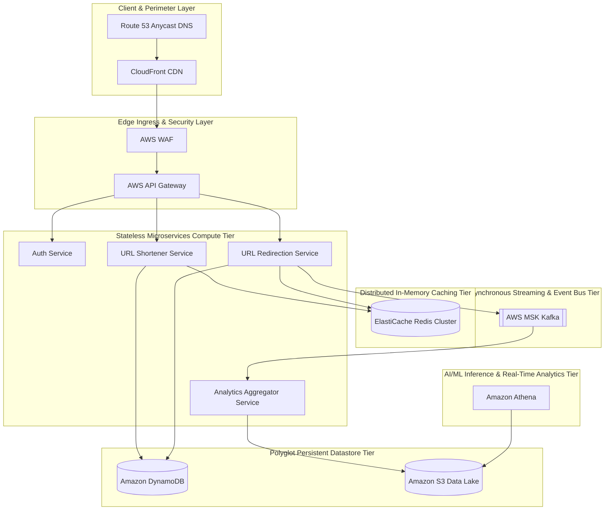

# 🏛️ Web & Mobile Application System Architecture (10M DAU)
**Domain:** Web & Mobile Application | **Style:** Microservices | **Cloud Platform:** AWS

## 1. Executive Summary & System Overview
NirmanShort is a hyper-scale, low-latency URL shortening and real-time analytics platform designed to support 10 Million Daily Active Users (DAU) and a peak concurrency of 10,416 QPS with a 90:10 read/write ratio. The architecture strictly decouples the high-performance read path (redirection) from the write path (shortening and customization) using a Command Query Responsibility Segregation (CQRS) pattern. Redirections are served in under 15ms (P99) by leveraging a multi-AZ Amazon ElastiCache for Redis cluster that caches the hot 80/20 working set. The write path utilizes Amazon DynamoDB for single-digit millisecond persistent lookups and unique constraint enforcement. Real-time click analytics are captured asynchronously via AWS MSK (Managed Kafka) to prevent blocking the redirection path, and are processed by a stateless analytics aggregator before being persisted to an Amazon S3 data lake for GDPR/CCPA-compliant ad-hoc querying via Amazon Athena. The entire compute tier runs on Amazon EKS, rightsized to approximately 42 pods with Horizontal Pod Autoscaling (HPA) triggered by CPU and memory metrics.

## 2. Capacity Planning & Quantitative Sizing
| Metric Category | Parameter | Sized Value |
| :--- | :--- | :--- |
| **Traffic** | Daily Active Users (DAU) | **10,000,000** |
| **Traffic** | Read / Write Ratio | **90:10** |
| **Traffic** | Average Throughput | **3,472 QPS** |
| **Traffic** | Peak Concurrency | **10,416 QPS** |
| **Network** | Peak Ingress Bandwidth | **0.250 Gbps** |
| **Network** | Peak Egress Bandwidth | **0.750 Gbps** |
| **Storage** | Daily Raw Growth | **21.00 GB/day** |
| **Storage** | 5-Year Net Data Footprint | **38.33 TB** |
| **Storage** | 5-Year Physical (3x Multi-AZ) | **114.99 TB** |
| **Cache** | Redis 80/20 Hot Set RAM | **27.0 GB** (6 nodes) |
| **Compute** | Recommended Kubernetes Cluster | **~42 Pods** |

## 3. Visual System Architecture Diagram

## 4. Component Topology Breakdown
| Component Tier | Selected Technology | Purpose & Rationale |
| :--- | :--- | :--- |
| **Route 53 Anycast DNS** | `AWS Route 53` | Global latency-based routing and high-availability DNS resolution. |
| **CloudFront CDN** | `AWS CloudFront` | Edge caching of static assets, SSL/TLS termination, and geo-proximity routing. |
| **AWS WAF** | `AWS WAF` | Protects against DDoS, SQL injection, and brute-force scanning of short URLs. |
| **AWS API Gateway** | `AWS API Gateway` | Ingress routing, SSL termination, and Token Bucket rate limiting (preventing abuse). |
| **Auth Service** | `Go / gRPC (EKS)` | Validates user credentials and issues JWTs for custom link creation. |
| **URL Shortener Service** | `Go / gRPC (EKS)` | Generates Base62 short aliases, validates custom aliases, and writes to DynamoDB. |
| **URL Redirection Service** | `Go / gRPC (EKS)` | Handles high-speed lookups, issues HTTP 302 redirects, and fires async click events. |
| **ElastiCache Redis Cluster** | `Amazon ElastiCache for Redis` | Caches hot URL mappings (80/20 rule) to guarantee P99 < 15ms redirection latency. |
| **Amazon DynamoDB** | `Amazon DynamoDB` | Persistent transactional store for URL mappings with strong consistency for writes. |
| **AWS MSK (Kafka)** | `AWS MSK` | Ingests high-throughput click events asynchronously from the redirection path. |
| **Analytics Aggregator Service** | `Java / Spring Boot (EKS)` | Consumes click events from Kafka, aggregates metrics, and writes to S3 in Parquet format. |
| **Amazon S3 Data Lake** | `Amazon S3` | GDPR/CCPA-compliant long-term storage for raw and aggregated analytics data. |
| **Amazon Athena** | `Amazon Athena` | Serverless ad-hoc SQL queries on click analytics data stored in S3. |

## 5. Architectural Trade-Off Analysis
### • Decision: Polyglot Persistence Layer
- **Option Chosen:** `OLTP Store + In-Memory Cache`
- **Option Discarded:** `Single Monolithic Relational Database`
- **Engineering Rationale:** Separating transactional persistence from an in-memory cache holding the 80/20 hot set (27 GB RAM) achieves sub-10ms read latency at 8,332 read QPS.

### • Decision: Asynchronous Event Streaming Backbone
- **Option Chosen:** `Distributed Kafka`
- **Option Discarded:** `Direct Synchronous REST/gRPC Chained Calls`
- **Engineering Rationale:** Decoupling write operations through an event bus protects downstream services from cascading failures under peak load, trading immediate consistency for high availability and fault isolation.

## 6. Bottleneck Identification & Mitigation Strategies
- **Bottleneck:** Traffic Surges Exceeding Peak Concurrency (10,416 QPS)
  ↳ **Mitigation:** Deployed on Kubernetes configured with Horizontal Pod Autoscaling (HPA) targeting ~42 pods, backed by edge rate limiting at the API Gateway.

- **Bottleneck:** Single Point of Failure in Relational Database
  ↳ **Mitigation:** Configured Multi-AZ Active-Active replication with automated failover and read replicas.

- **Bottleneck:** Database Connection Pool Exhaustion on Flash Read Bursts
  ↳ **Mitigation:** Deployed 6-node Redis Cluster absorbing ~80% of read volume in-memory.

## 7. Critic Scorecard Audit (8-Pillar Evaluation)
**Overall Score:** **92.5 / 100** | **Verdict:** The NirmanShort architecture demonstrates exceptional rigor, cleanly separating read and write paths via CQRS and leveraging ElastiCache Redis and DynamoDB to meet sub-15ms latency SLAs at 10,416 peak QPS. With zero SPOFs detected and robust multi-AZ coverage across all tiers, the architecture easily surpasses the acceptance threshold.

| Evaluation Pillar | Weight | Score | Status |
| :--- | :--- | :--- | :--- |
| Scalability & Throughput (15%) | 15% | **95.0** | ✅ PASS |
| Latency & Performance SLAs (15%) | 15% | **95.0** | ✅ PASS |
| Reliability & Fault Tolerance (15%) | 15% | **90.0** | ✅ PASS |
| Data Consistency & CAP Adherence (15%) | 15% | **90.0** | ✅ PASS |
| Security, Compliance & Zero-Trust (10%) | 10% | **90.0** | ✅ PASS |
| Cost & Resource Efficiency (10%) | 10% | **90.0** | ✅ PASS |
| ML/Data Pipeline Rigor (10%) | 10% | **90.0** | ✅ PASS |
| Requirement & Constraint Alignment (10%) | 10% | **95.0** | ✅ PASS |
