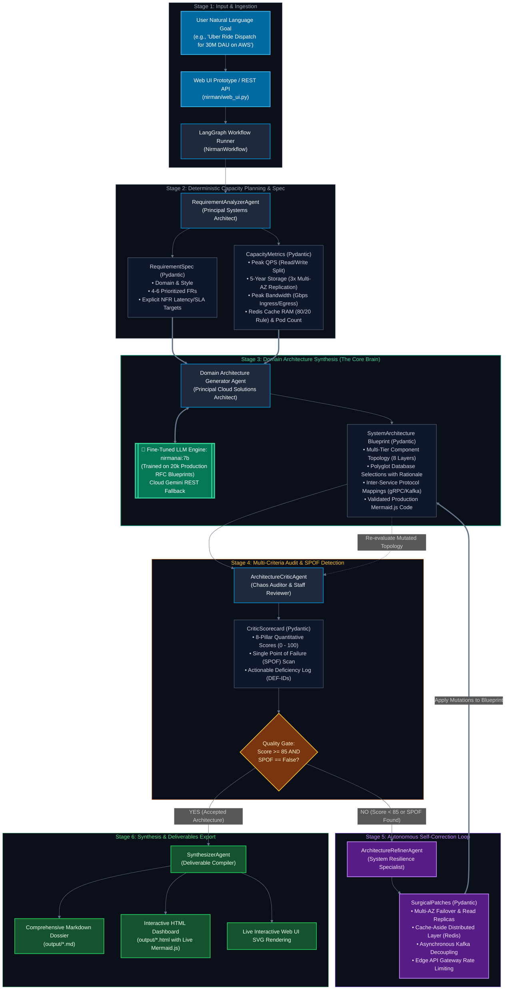
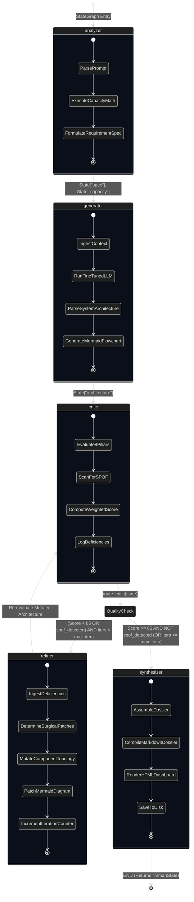
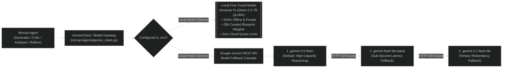

# NirmanAI — Comprehensive System Architecture & Engineering Workflow
> **Technical Specification of the Autonomous Multi-Agent Synthesis & Self-Refining Evaluation Engine**
> *Strictly aligned with the NirmanAI Architectural Masterplan ([`README.md`](README.md))*

---

## 1. Executive Summary & Design Philosophy

Designing hyperscale, fault-tolerant, and cost-effective distributed systems requires reconciling competing trade-offs: latency vs. consistency, throughput vs. durability, and cost vs. redundancy. Standard one-shot LLM generations routinely fail because they hallucinate buzzwords, ignore back-of-the-envelope capacity constraints, and leave single points of failure (SPOFs) unaddressed.

**NirmanAI** re-engineers this paradigm as an **autonomous, closed-loop engineering state machine**. Orchestrated natively via **LangGraph** and validated with strict **Pydantic v2** schema contracts, NirmanAI integrates:
1. **Mathematical Capacity Planning**: Rigorous back-of-the-envelope calculations (QPS, 5-year multi-AZ storage, bandwidth, and cache RAM) before any component is selected.
2. **Domain-Specific Fine-Tuned Model (`nirmanai:7b`)**: QLoRA-adapted on 20,000 production system design RFCs, postmortems, and trade-off matrices.
3. **Independent 8-Pillar Quality Gate**: A ruthless Critic Agent auditing architectures against industry resilience rubrics and rejecting SPOFs.
4. **Autonomous Surgical Refinement**: A feedback loop that mutates topology, introduces decoupling, and re-evaluates until quality converges ($\ge 85/100$).
5. **Interactive Deliverables**: Automated synthesis of production-ready Mermaid.js flowcharts, Markdown dossiers, and interactive HTML dashboards.

---

## 2. Comprehensive System Workflow Diagrams

### 2.1 End-to-End Multi-Agent Dataflow Architecture

The diagram below details the 6-stage lifecycle of a requirement, showing the exact Pydantic artifacts flowing between each autonomous agent:



---

### 2.2 LangGraph State Machine & Conditional Branching Logic

The engine's lifecycle is formally governed by the **LangGraph StateGraph** compiled in [`nirman/workflow/graph.py`](nirman/workflow/graph.py):



---

### 2.3 Temporal Sequence Diagram

```mermaid
sequenceDiagram
    autonumber
    actor User
    participant UI as Web UI / CLI
    participant WF as NirmanWorkflow (LangGraph)
    participant ANA as RequirementAnalyzer
    participant GEN as ArchitectureGenerator
    participant LLM as Fine-Tuned Model (nirmanai:7b)
    participant CRT as ArchitectureCritic
    participant REF as ArchitectureRefiner
    participant SYN as SynthesizerAgent

    User->>UI: Submit Architecture Goal (e.g. "Uber Dispatch for 30M DAU")
    UI->>WF: invoke(initial_state)
    
    rect rgb(15, 23, 42)
        Note over WF,ANA: Phase 1: Analysis & Capacity Sizing
        WF->>ANA: analyze(raw_prompt)
        ANA-->>WF: (RequirementSpec, CapacityMetrics)
    end

    rect rgb(4, 120, 87)
        Note over WF,GEN: Phase 2: Synthesis via Fine-Tuned Core
        WF->>GEN: generate(spec, capacity)
        GEN->>LLM: Inference (Prompt + Sizing Constraints)
        LLM-->>GEN: Structured JSON (Topology + Mermaid)
        GEN-->>WF: SystemArchitecture
    end

    rect rgb(180, 83, 9)
        Note over WF,CRT: Phase 3: 8-Pillar Audit & SPOF Detection
        WF->>CRT: audit(spec, capacity, architecture)
        CRT-->>WF: CriticScorecard (Score, SPOF, DeficiencyLog)
    end

    alt Score < 85 or SPOF Detected (Refinement Loop)
        rect rgb(88, 28, 135)
            Note over WF,REF: Phase 4: Autonomous Surgical Self-Correction
            WF->>REF: refine(architecture, scorecard, iteration)
            REF->>LLM: Generate Patches & Mutate Topology
            LLM-->>REF: Patched Architecture + SurgicalPatches
            REF-->>WF: (Mutated Architecture, RefinementIteration)
            WF->>CRT: audit(spec, capacity, mutated_architecture)
            CRT-->>WF: Updated CriticScorecard
        end
    end

    rect rgb(21, 128, 61)
        Note over WF,SYN: Phase 5: Final Compilation & Export
        WF->>SYN: synthesize(spec, capacity, architecture, scorecard, history)
        SYN->>SYN: to_markdown(), to_html(), save()
        SYN-->>WF: (ArchitectureDossier, saved_files)
    end

    WF-->>UI: Complete NirmanState
    UI-->>User: Live SVG Diagram, Capacity Stats, Download Links (.md, .html)
```



---

## 3. Mathematical Capacity Estimation Engine

Before any architecture is generated, the [`RequirementAnalyzerAgent`](nirman/agents/analyzer.py) executes deterministic capacity math to guarantee that all database, compute, network, and caching layers are quantitatively grounded.

### 3.1 Throughput & Concurrency Formulation
* **Average Throughput (QPS)**:
  $$\text{QPS}_{\text{avg}} = \frac{\text{DAU} \times \text{Ops/User/Day}}{86,400\text{ seconds}}$$
* **Peak Concurrency (QPS)**:
  $$\text{QPS}_{\text{peak}} = \text{QPS}_{\text{avg}} \times \text{Peak Factor} \quad (\text{Default Peak Factor} = 3.0\times - 4.5\times)$$
* **Traffic Split**:
  $$\text{QPS}_{\text{read}} = \text{QPS}_{\text{peak}} \times R_{\text{read}}, \quad \text{QPS}_{\text{write}} = \text{QPS}_{\text{peak}} \times R_{\text{write}}$$

### 3.2 Storage Projections (Factoring Multi-AZ Replication)
* **Daily Net Ingress**:
  $$\text{Storage}_{\text{daily (GB)}} = \frac{\text{DAU} \times \text{Write Ops/User} \times \text{Avg Payload Size (Bytes)}}{10^9}$$
* **5-Year Net Storage**:
  $$\text{Storage}_{\text{5yr net (TB)}} = \frac{\text{Storage}_{\text{daily (GB)}} \times 365 \times 5}{1024}$$
* **5-Year Effective Physical Storage (3x Multi-AZ)**:
  $$\text{Storage}_{\text{effective (TB)}} = \text{Storage}_{\text{5yr net (TB)}} \times 3.0 \quad (\text{Primary + 2 Read Replicas})$$

### 3.3 Network Bandwidth Sizing
* **Peak Ingress Bandwidth**:
  $$\text{Bandwidth}_{\text{ingress (Gbps)}} = \frac{\text{QPS}_{\text{write}} \times \text{Write Payload (Bytes)} \times 8}{10^9}$$
* **Peak Egress Bandwidth**:
  $$\text{Bandwidth}_{\text{egress (Gbps)}} = \frac{\text{QPS}_{\text{read}} \times \text{Read Payload (Bytes)} \times 8}{10^9}$$

### 3.4 In-Memory Caching (80/20 Pareto Rule)
* **Redis Cluster RAM Sizing**:
  $$\text{Cache RAM (GB)} = (\text{Daily Read Data (GB)}) \times 0.20$$
* **Redis Node Sizing**:
  $$\text{Node Count} = \left\lceil \frac{\text{Cache RAM (GB)}}{26\text{ GB per } r6g.xlarge \text{ node}} \right\rceil \times 2 \quad (\text{Primary + Replica})$$

### 3.5 Compute Tier Autoscaling (Kubernetes Pod Sizing)
* **Compute Pod Concurrency**:
  $$\text{Pod Count} = \left\lceil \frac{\text{QPS}_{\text{peak}}}{\text{Pod Concurrency Target (e.g., 250 QPS/pod)}} \right\rceil$$

---

## 4. Deep Agent Specification & Schema Contracts

### 4.1 Requirement Analyzer Agent
* **Role**: Principal Systems Architect & Capacity Planner.
* **Input**: Unstructured natural language goal.
* **Output Artifacts**:
  - [`RequirementSpec`](nirman/schemas/analyzer.py): Classifies domain, scale tier, preferred style, prioritized functional requirements (`FR-01` to `FR-06`), and non-functional SLAs (P99 latency, availability, data consistency).
  - [`CapacityMetrics`](nirman/schemas/estimator.py): TrafficMetrics, StorageMetrics, NetworkMetrics, CacheMetrics, and compute pod sizing.

### 4.2 Architecture Generator Agent (The Fine-Tuned LLM Engine)
* **Role**: Principal Cloud Solutions Architect.
* **Brain Engine**: **Fine-Tuned `nirmanai:7b`** (QLoRA on Qwen-2.5-7B, served via Ollama) with Google Gemini REST fallback.
* **Synthesis Scope**: Generates an 8-layer multi-tier architecture:
  1. *Client & Perimeter Tier*: Anycast DNS, Web, Mobile, IoT devices.
  2. *Edge Ingress & Security Tier*: CloudFront CDN, AWS WAF, Envoy API Gateway with token bucket rate limiting.
  3. *Stateless Microservices Compute Tier*: Kubernetes EKS cluster rightsized for the calculated pod concurrency.
  4. *Asynchronous Streaming & Event Bus Tier*: Apache Kafka / AWS MSK partitioned by entity key.
  5. *In-Memory Caching Tier*: Multi-node Redis Cluster sized for the 80/20 hot working set.
  6. *Polyglot Persistent Datastore Tier*: OLTP PostgreSQL/Aurora + NoSQL DynamoDB/Cassandra + Analytical ClickHouse/BigQuery.
  7. *AI/ML Inference & Real-Time Analytics Tier*: Triton Inference Server with dynamic batching (where applicable).
  8. *Observability & Telemetry Tier*: Prometheus, OpenTelemetry, Grafana, Jaeger distributed tracing.
* **Output Artifact**: [`SystemArchitecture`](nirman/schemas/generator.py) containing all `ComponentNode`s, `ConnectionEdge`s, and full Mermaid.js flowchart code.

### 4.3 Architecture Critic Agent
* **Role**: Senior Principal Staff Auditor & Chaos Engineer.
* **Audit Rubric**: Evaluates the candidate blueprint across 8 weighted engineering pillars:
  
| Evaluation Pillar | Weight | Target Metric | Audit Focus |
| :--- | :---: | :--- | :--- |
| **1. Scalability & Throughput** | 15% | 10x Peak Headroom | Database sharding, HPA, stateless compute, connection pooling |
| **2. Latency & Performance SLAs** | 15% | p99 < 50ms | Async decoupling, CDN caching, cache-aside Redis, non-blocking I/O |
| **3. Reliability & Fault Tolerance** | 15% | 99.99% Availability | Zero SPOFs, Multi-AZ failovers, circuit breakers, dead-letter queues |
| **4. Data Consistency & Integrity** | 15% | Strict CAP Adherence | SAGA patterns for distributed transactions, Raft / 2PC guarantees |
| **5. Security & Zero Trust** | 10% | Zero Trust Architecture | mTLS service mesh, JWT/OIDC gateway, AES-256 at-rest, TLS 1.3 |
| **6. Cost & Resource Efficiency** | 10% | Optimal Tiering | Hot/Warm/Cold storage tiers, rightsized clusters, spot GPU usage |
| **7. ML & Data Pipeline Rigor** | 10% | No Data Leakage | Real-time feature consistency, dynamic batching, drift monitoring |
| **8. Requirement Alignment** | 10% | 100% FR/NFR Coverage | Verifies all explicit user functional requirements and constraints |

* **Single Point of Failure (SPOF) Scan**:
  - Flags any database deployed without a Multi-AZ replica (`spof_detected = True`).
  - Flags any single API gateway without cross-region or multi-AZ ingress redundancy.
  - Flags any synchronous RPC call chain spanning $>3$ sequential services.
* **Output Artifact**: [`CriticScorecard`](nirman/schemas/critic.py) containing overall score, pillar breakdowns, and `DeficiencyFinding` log.

### 4.4 Architecture Refiner Agent
* **Role**: System Resilience & Remediation Specialist.
* **Action Taxonomy**: Applies surgical patches mapped to identified flaws:
  - `MULTI_AZ_FAILOVER`: Replaces standalone database nodes with Multi-AZ automated failover clusters.
  - `INTRODUCE_CACHE`: Inserts a distributed Redis Cluster between services and persistence tiers.
  - `DECOUPLE_ASYNC`: Replaces blocking synchronous RPCs with Kafka / RabbitMQ event-driven queues.
  - `SHARD_DATABASE`: Implements horizontal partitioning keys to eliminate write hot-spots.
  - `ADD_API_GATEWAY`: Inserts an edge gateway with rate limiting, TLS termination, and WAF rules.
* **Output Artifact**: Mutated [`SystemArchitecture`](nirman/schemas/generator.py) + [`RefinementIteration`](nirman/schemas/refiner.py) log.

### 4.5 Synthesizer Agent
* **Role**: Deliverable Assembly Compiler.
* **Function**: Assembles all verified artifacts into the 8-module **System Architecture Dossier**:
  1. *Executive Summary & Quantitative Capacity Planning*
  2. *Interactive Mermaid.js Architecture Diagram*
  3. *Deep Component-by-Component Technical Specification*
  4. *Data Storage, Partitioning Keys & Caching Policies*
  5. *ML / Data Science / Big Data Subsystems (when present)*
  6. *Resilience, Disaster Recovery & Security Matrix*
  7. *Architectural Trade-Off Analysis (Why Option X was chosen over Option Y)*
  8. *Critic Quality Scorecard & Full Refinement Changelog*
* **Output Artifacts**:
  - Production Markdown: `output/<system_title>.md`
  - Standalone Interactive HTML: `output/<system_title>.html`

---

## 5. Dual-Engine LLM Serving Infrastructure

NirmanAI provides seamless switching between local fine-tuned execution and cloud API execution:



---

## 6. Global State Schema (`NirmanState`)

The shared LangGraph state container defined in [`nirman/workflow/state.py`](nirman/workflow/state.py) enforces full typing across all nodes:

```python
class NirmanState(TypedDict):
    """Global state container for the NirmanAI LangGraph cyclic architecture engine."""
    raw_prompt: str                               # Initial user prompt
    spec: Optional[RequirementSpec]               # Phase 1: Structured specification
    capacity: Optional[CapacityMetrics]           # Phase 1: Capacity sizing calculations
    architecture: Optional[SystemArchitecture]   # Phase 2 & 5: Candidate/Mutated blueprint
    scorecard: Optional[CriticScorecard]          # Phase 3: 8-pillar audit evaluation
    iterations: int                               # Current refinement loop count
    max_iterations: int                           # Hard limit to prevent infinite loops (default 2)
    refinement_history: List[RefinementIteration] # Historical changelog of applied patches
    dossier: Optional[ArchitectureDossier]        # Phase 6: Final assembled deliverable
    saved_files: Optional[Dict[str, str]]         # Disk paths for exported .md and .html
    error: Optional[str]                          # Execution trace if an unrecoverable failure occurs
```

---

## 7. Execution Quickstart

### Launch the Prototype Web UI
```bash
uv run --python .venv\Scripts\python.exe python nirman/web_ui.py
```
* Access the interface at **`http://localhost:8080`**.
* Direct `.env` key loading (no API keys required in browser).
* Real-time multi-agent execution pipeline display.
* Dynamic client-side Mermaid.js SVG rendering with zoom/pan.
* 1-Click downloads for both Markdown dossiers and HTML dashboards.

### Programmatic Python Execution
```python
from nirman.workflow import NirmanWorkflow

# Initialize workflow engine with custom max iterations
wf = NirmanWorkflow(max_iterations=2)

# Execute full cyclic multi-agent synthesis loop
result = wf.run("Design an e-commerce flash sale platform handling 50M active shoppers on AWS")

print("System Title:", result["dossier"].title)
print(f"Final Quality Score: {result['scorecard'].overall_score}/100 (Accepted: {result['scorecard'].is_accepted})")
print(f"Single Points of Failure: {result['scorecard'].spof_count}")
print("Markdown Dossier:", result["saved_files"]["markdown"])
print("Interactive Dashboard:", result["saved_files"]["html"])
```
